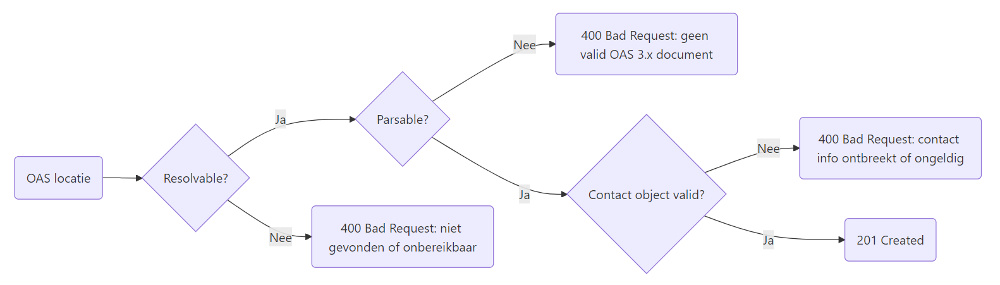
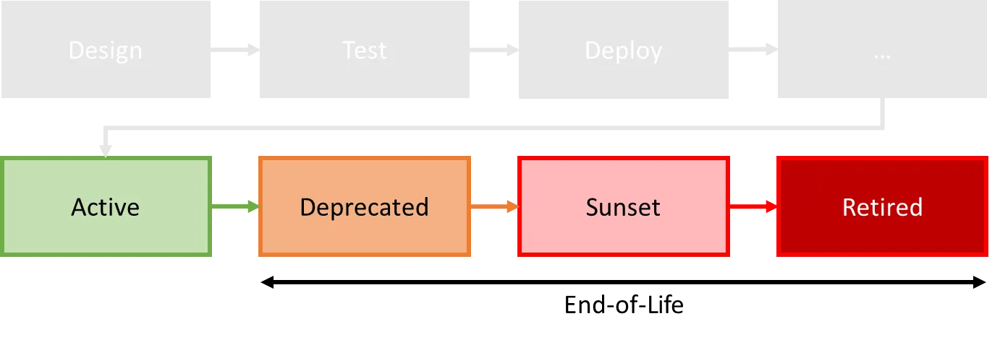
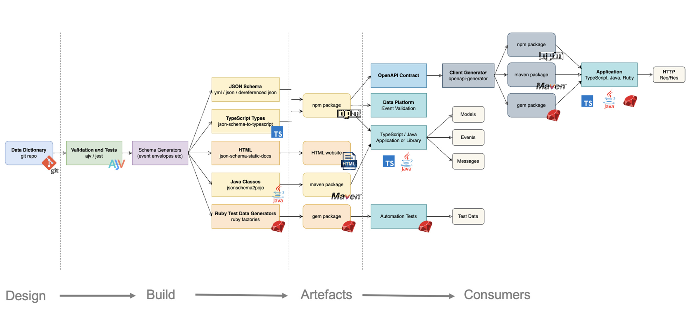

# developer.overheid.nl

<!-- _class: title -->

Dimitri van Hees
<d.vanhees@geonovum.nl>

## Dimitri van Hees

- API architect, consumer, provider, developer
- Co-auteur DSO en NLGov API Strategie
- OpenAPI Specification contributor en indiener bij PTOLU
- Product Owner en API architect @ developer.overheid.nl
- Mede-eigenaar en bierbrouwer @ Brouwtoren, Nijmegen

## Developer portal
<!-- _class: title -->

## Developer portal

- "A developer portal provides a central place for developers to discover and use services."
- "To be clear, **it's not simply an API catalog**. It comprises more than a list of API specs and documentation."
- "It's a **central place for developers to go and learn** about the systems that they work on and interact with."
- "It provides **self-service tools** to get devs integrated quickly and easily."
- "And it gives folks **a place to go when they have questions**."

https://www.opslevel.com/resources/developer-portals-what-are-they-and-why-do-you-need-them

## Developer Experience (DX)
<!-- _class: title -->

## developer.overheid.nl

- Kennisbank
- Blog
- Tools
- Open Source register
- API register

## Release early, release often
<!-- _class: title -->

## Practice what you preach

- Front-end obv NL Design System
- Open Source
- API-first (niet te verwarren met API design-first!)

## Demo Kennisbank
<!-- _class: title -->
<!-- ADR, Tools, eindigen met Open Source register -->

<!-- ## NL API Design Rules (ADR)

- Standaard conventies voor (RESTful) API's
- Op de **pas-toe-of-leg-uit lijst** van Forum Standaardisatie
- In beheer bij Logius
- Modulaire opzet

## Tools

- OAS generator
- OAS checker
- OAS converter (3.0 to 3.1 en back)
- Design rules code templates
- OSS generator
- publiccode checker -->

## Publiccode.yml

- "OAS voor OSS" in de publieke sector
- Samenwerking EU, Italië, Brussel
- Koppeling met Europees OSS-register van Europese Commissie

## API register
<!-- _class: title -->

## Verplichte standaarden

- OpenAPI Specification (OAS)
- REST API Design Rules (ADR)

## OpenAPI-first

- Contact info (ADR 2.1)
- Environments (nog niet in ADR)
- Security (mTLS vanaf 3.1)
- Example(s) tbv mocking services en SDK's
- JSON schemas (vanaf 3.1)

## ADR Scores

- Op basis van generieke OAS checker ipv validator
- Hulp bij afwijkingen
- Representatiever want alleen REST

## Organisatie

- Identificatie o.b.v. credentials
- Gekoppeld aan TOOI (Thesauri en Ontologieën voor Overheidsinformatie)
- Uitzondering voor organisaties buiten ROO

## Aanleverprocedure



## API verwijderen

- Contact opnemen om API te laten verwijderen
- Dit omdat een API niet zomaar "verwijderd" kan worden; dit is een lifecycle wijziging

## API Lifecycle
<!-- _class: title -->

## API Lifecycle "End-of-Life" phase



## Geen standaard, wél API register extensie

```yaml
openapi: 3.0.3
info:
  version: 1.2.3
  x-deprecated: 2025-10-10 # toekomst of verleden
  x-sunset: 2027-11-11     # altijd in de toekomst
```

## Demo API register
<!-- _class: title -->

## Arazzo
<!-- _class: title -->

## Arazzo support

- Arazzo als functionele documentatie per API
- Arazzo als functionele documentatie van samenhangende API's (DSO)
- Visualisatie

## Arazzo syntax

```yaml
arazzo: 1.0.1
info:
  title: Title
  summary: Summary
  version: 0.0.1
sourceDescriptions:
  - name: productApi
    url: http://localhost:8080/product-api/v1/openapi.json
    type: openapi
workflows:
  - workflowId: buyProduct
    steps:
      - stepId: getProduct
        operationId: $sourceDescriptions.productApi.getProduct
      - stepId: addToCart
        operationId: $sourceDescriptions.productApi.addToCart
```

## Arazzo.png
<!-- _class: image -->


## JSON Schemas
<!-- _class: title -->

## Schema register

- Discoverability
- Reusability
- Versioning
- Documentation
- Codegen van types, classes, etc.

## schemas.developer.overheid.nl

- CORS policy
- Versiebeheer
- Zoeken
- API design; hergebruik en goede examples in docs

## https:\/\/api.developer.overheid.nl/api-register/v1/openapi.json

```json
{
  "/beers/{id}": {
    "parameters": [
      {
        "$ref": "#/components/parameters/id"
      }
    ],
    "get": {
      "responses": {
        "200": {
          "content": {
            "application/json": {
              "schema": {
                "$ref": "https://schemas.developer.overheid.nl/beer.json"
              }
            }
          }
        }
      }
    }
  }
}
```

## https:\/\/schemas.developer.overheid.nl/beer.json

```json
{
  "$schema": "http://json-schema.org/draft-04/schema#",
  "type": "object",
  "properties": {
      "name": {
          "type": "string"
      },
      "brewery": {
        "type": "object",
        "properties": {
          "$ref": "https://schemas.developer.overheid.nl/brewery.json"
        }
      }
  },
  "required": ["name", "brewery"]
}
```

## https:\/\/schemas.developer.overheid.nl/brewery.json

```json
{
  "$schema": "https://json-schema.org/draft/2020-12/schema",
  "type": "object",
  "properties": {
    "name": {
      "type": "string"
    },
    "url": {
      "type": "string"
    },
    "address": {
      "type": "object",
      "$ref": "https://schemas.developer.overheid.nl/address.json"
    }
  },
  "required": ["name"]
}
```

## DVLA
<!-- _class: image -->


## Typescript

```ts
export interface Beer {
  name: string;
  brewery: Brewery;
  alcohol?: number;
}
```

```ts
export interface Brewery {
  name: string;
  address: Address;
  url?: string;
}
```

```ts
export interface Address {
  street: string;
  postalCode: string;
  //etc....
}
```

## Large Language Models!
<!-- _class: title -->

## Project landschap
<!-- _class: title -->

## HLA
<!-- _class: image -->


## Losse repositories

- Makkelijker te hergebruiken
- Makkelijker te managen
- Makkelijker aan te contributen
- "Mix & Match"

## Mix & Match
<!-- _class: image -->


## Implementatie-ondersteuning

<!-- _class: title -->

## Implementatie-ondersteuning

Wat we kunnen bieden:

- Toepassing van federatieve architectuurprincipes
- Begeleiding bij de implementatie van standaarden
- Ondersteuning bij casussen en architectuurvraagstukken

Wat we willen bereiken:

- Het gebruik van standaarden vergemakkelijken
- Duidelijke richtlijnen bieden voor het implementeren van standaarden
- Knelpunten in standaarden identificeren en adresseren
- Kennisborging

## Help mee

- Kennisbank artikelen
- Blogposts
- Interviews
- Pull requests
- Feature requests
- Ideeën

## Spread the word!
<!-- _class: title -->

## Op naar één centrale plek voor software development bij de overheid!
<!-- _class: title -->

- E-mail: <developer.overheid@geonovum.nl>
- Bijdragen: <https://developer.overheid.nl/contributing>
- Mastodon: <https://social.overheid.nl/@developer>
- Slack: <https://codefornl.slack.com/archives/CFV4B3XE2>
- Github: <https://github.com/developer-overheid-nl>
