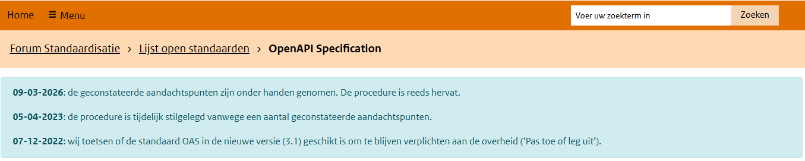
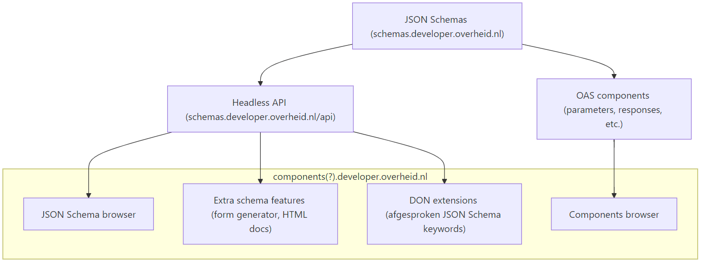
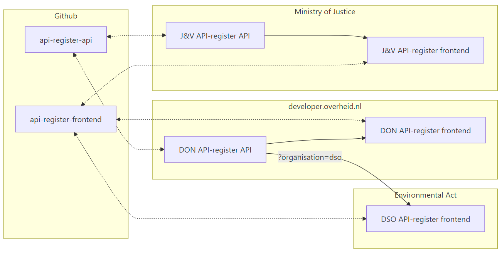
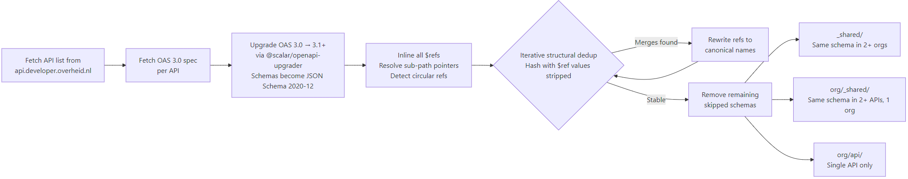

# Herbruikbare schemas via developer.overheid.nl

<!-- _class: title -->

Dimitri van Hees
<d.vanhees@geonovum.nl>

## Dimitri van Hees

- API architect, consumer, provider, developer
- Co-auteur DSO en NLGov API Strategie
- OpenAPI Specification contributor en indiener bij PTOLU
- Product Owner en API architect @ developer.overheid.nl
- Mede-eigenaar en bierbrouwer @ Brouwtoren, Nijmegen

## JSON Schema

- XSD voor JSON
- Geschreven in JSON (of YAML)
- Breed gedragen standaard
- Versies: Draft-07, 2019-09, 2020-12 (stable)

## OAS 3.1



## JSON Schema is de gemeenschappelijke taal tussen developers, systemen, code én AI
<!-- _class: title -->

## LLM's

- Codegeneratie
- Input validatie
- Output validatie
- Register als single source of truth voor zowel code als AI

## JSON Schema register
<!-- _class: title -->

## DVLA
<!-- _class: image -->


## Sourcemeta One

- Open Source
- Onderhouden door JSON Schema TSC members

## Demo
<!-- _class: title -->

## Code generatie
<!-- _class: title -->

## OAS Components

- parameters
- responses
- requestBodies
- headers
- securitySchemes

## Voorbeeld: 400 response

```json
"responses": {
  "400": {
    "$ref": "https://static.developer.overheid.nl/adr/components.yaml#/responses/400"
  }
}
```

## https://.../adr/components.yaml#/responses/400

```yaml
headers:
  API-Version:
    $ref: "#/headers/API-Version"
  Link:
    $ref: "#/headers/Link"
description: Bad request
content:
  application/problem+json:
    schema:
      type: object
      properties:
        title:
          type: string
          example: Request validation failed
        invalidParams:
          type: object
          properties:
            name:
              type: string
              example: url
            reason:
              type: string
              example: Invalid URI format
```

## Mét schema

```yaml
headers:
  API-Version:
    $ref: "#/headers/API-Version"
  Link:
    $ref: "#/headers/Link"
description: Bad request
content:
  application/problem+json:
    schema:
      $ref: https://schemas.don.apps.digilab.network/adr/adr/problemjson.json
```

## Voorbeeld in Bier API
<!-- _class: title -->

## Plan

- Schema storage: schemas.developer.overheid.nl headless
- Hergebruik generieke frontend
- Extra JSON Schema features
- Plek voor OAS components
- Toekomstige andere components (OAS 3.0, AsyncAPI, TS Types?)

## Plan img
<!-- _class: image -->
<br/><br/>



## Generieke frontend

- WCAG-compatible
- Herbruikbaar in API- en OSS-register
- Gedeelde functionaliteiten
- Federatief

## Mix & Match
<!-- _class: image -->


## API-register
<!-- _class: title -->

## Flow



## 5000+ schemas

- `x-derived-from`
- Koppeling stelselcatalogus
- Kwaliteitscontrole

## Nog een demo
<!-- _class: title -->

## JSON Schema Design Rules
<!-- _class: title -->

## Style (1/2)

| Rule                             | Description                                                                                                                             |
| ------------------------------ | -------------------------------------------------------------------------------------------------------------------------------- |
| top_level_title                | Set a concise non-empty title at the top level of the  schema to explain what the definition is about                            |
| title_trailing_period          | Titles should not end with a period to give user interfaces flexibility in presenting the text                                   |
| title_trim                     | Titles should not contain leading or trailing whitespace                                                                         |
| top_level_description          | Set a non-empty description at the top level of the schema to explain what the definition is about in detail                     |
| description_trailing_period    | Descriptions should not end with a period to give user interfaces flexibility in presenting the text                             |

## Style (2/2)

| Rule                             | Description                                                                                                                             |
| ------------------------------ | -------------------------------------------------------------------------------------------------------------------------------- |
| description_trim               | Descriptions should not contain leading or trailing whitespace                                                                   |
| title_description_equal        | The title and description metadata keywords should not be set to the same value                                                  |
| simple_properties_identifiers  | Set `properties` to identifier names that can be easily mapped to programming languages (matching [A-Za-z_][A-Za-z0-9_]*)        |
| top_level_examples             | Set a non-empty examples array at the top level of the schema to illustrate the expected data                                    |

## Antipatterns

| Rule                             | Description                                                                                                                             |
| ------------------------------ | -------------------------------------------------------------------------------------------------------------------------------- |
| definitions_to_defs            | `definitions` was superseded by `$defs` in 2019-09 and later versions                                                            |
| duplicate_examples             | Setting duplicate values in `examples` is redundant                                                                              |
| enum_to_const                  | An `enum` of a single value can be expressed as `const`                                                                          |
| equal_numeric_bounds_to_const  | Setting `minimum` and `maximum` to the same number only leaves one possible value                                                |

## ...does not add any further constraint (1/2)

| Rule                             | Description                                                                                                                             |
| ------------------------------ | -------------------------------------------------------------------------------------------------------------------------------- |
| content_schema_default         | Setting `contentSchema` to the true schema...                                        |
| dependencies_default           | Setting `dependencies` to an empty object... |
| dependent_required_default     | Setting `dependentRequired` to an empty object...          |
| items_array_default            | Setting `items` to the empty array...  |
| items_schema_default           | Setting `items` to the true schema... |
| multiple_of_default            | Setting `multipleOf` to 1... |
| pattern_properties_default     | Setting `patternProperties` to the empty object...  |

## ...does not add any further constraint 2/2

| Rule                             | Description                                                                                                                             |
| ------------------------------ | -------------------------------------------------------------------------------------------------------------------------------- |
| properties_default             | Setting `properties` to the empty object...      |
| property_names_default         | Setting `propertyNames` to the empty object...      |
| property_names_type_default    | Setting `type` to `string` inside `propertyNames`...    |
| unevaluated_items_default      | Setting `unevaluatedItems` to the true schema...  |
| unevaluated_properties_default | Setting `unevaluatedProperties` to the true schema... |
| unsatisfiable_max_contains     | Setting `maxContains` to a number greater than or equal to the array upper bound...  |
| unsatisfiable_min_properties   | Setting `minProperties` to a number less than `required`... |

## NLGov JSON Schema Design Rules

- Naming conventions (`lowerCamelCase`, `kebab-base`...)
- URL structuur (`/v1/brouwerij.json`, `/brouwerij.v1.json`...)
- NL profiel op bestaande rules (`top_level_examples` wel of niet?)
- Severity (`warning`, `error`)
- `$refs` (obv `$id`, absoluut, relatief...)
- Gestandaardiseerde extensies (`x-derived-from`, `x-conforms-to`...)
- Raakt NLGov REST API Design Rules

## Nieuwe KPA werkgroep: JSON Schema


- [https://www.linkedin.com/in/dimitrivanhees/](https://www.linkedin.com/in/dimitrivanhees/)
- <d.vanhees@geonovum.nl>

## Op naar één centrale plek voor software development bij de overheid
<!-- _class: title -->

- E-mail: <developer.overheid@geonovum.nl>
- Bijdragen: <https://developer.overheid.nl/contributing>
- Mastodon: <https://social.overheid.nl/@developer>
- Slack: <https://codefornl.slack.com/archives/CFV4B3XE2>
- Github: <https://github.com/developer-overheid-nl>
