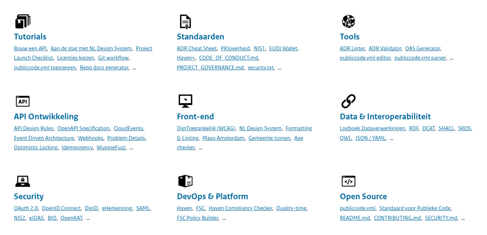
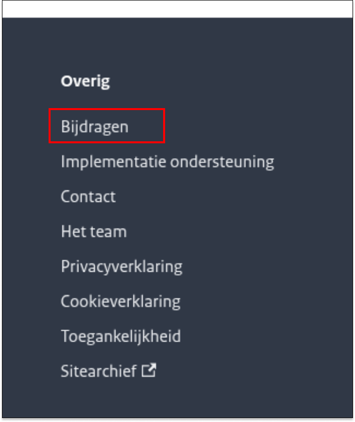
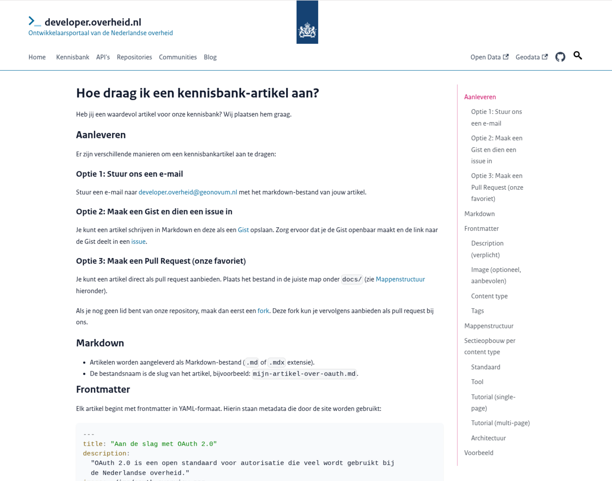

# developer.overheid.nl update

*22 april 2026*
<!-- _class: title -->

## Welkom!
<!-- Tom -->

- Open werken, zichtbaarheid, contributies, inspraak

## Kennisbank: herindeling hoofdthema's
<!-- Tom -->

- Tags
- Extra ingang: `content_type` (frontmatter markdown)

##
<!-- Tom -->

## Nieuw: kennisbank artikel aandragen
<!-- Tom -->

- Artikelen, blog, workflow

## Register-sites
<!-- Jaap-Hein -->

- Architectuur
  - [Astro](https://astro.build/): Structuur, routing, SSR/SSG, Markdown.
  - [Rijkshuisstijl community components](https://www.rijkshuisstijl-community.nl/): React component library op basis van NL Design System; [OpenAPI TypeScript](https://openapi-ts.dev/): Type declarations & fetch; [i18Next](https://www.i18next.com/): internationalization; [Biome](https://biomejs.dev/): formatting, linting and assist.
  - Monorepo; Aantal packages worden gepubliceerd op NPM.
- Register Site Template
  - https://github.com/developer-overheid-nl/register-site-template 
  - Alleen een front-end van de register sites om te clonen.
  - Maakt gebruik van de gepubliceerde packages.
- Hergebruik door DSO, Justid, RVO

---

[nieuwe filters](https://oss.developer.overheid.nl/)

## Changelogs
<!-- Matthijs -->

- Changie

## API's
<!-- Matthijs -->

- Trusted en untrusted clients
- Apisix
- Open Policy Agent (OPA)
- API-key aanvragen
- API lifecycle
- ADR scores

## Nieuwe checker
<!-- Dimitri -->

- Architectuur
- CLI
- Severities
- YAML support

## Schema-register
<!-- Dimitri -->

- OpenAPI 3.1
- Herbruikbare JSON Schema's
- Herbruikbare OAS components
- Schema Design Rules
- JSON-LD
- Nieuwe werkgroep: <d.vanhees@geonovum.nl>

## Publiccode.yml
<!-- Tom -->

- Nieuwste versie
- Known issues
- Verbeteren dmv AI

## AI Skills
<!-- Tom -->

- Disclaimer
- Anthrophic standaard

## Fysieke bijeenkomst
<!-- Tom -->

- Woensdag 17 juni
- Beatrixtheater, Utrecht
- Demo's
- Roadmap tweede halfjaar
- Save the dates: 9 & 10 juni: FOST (fka API Days) Amsterdam
