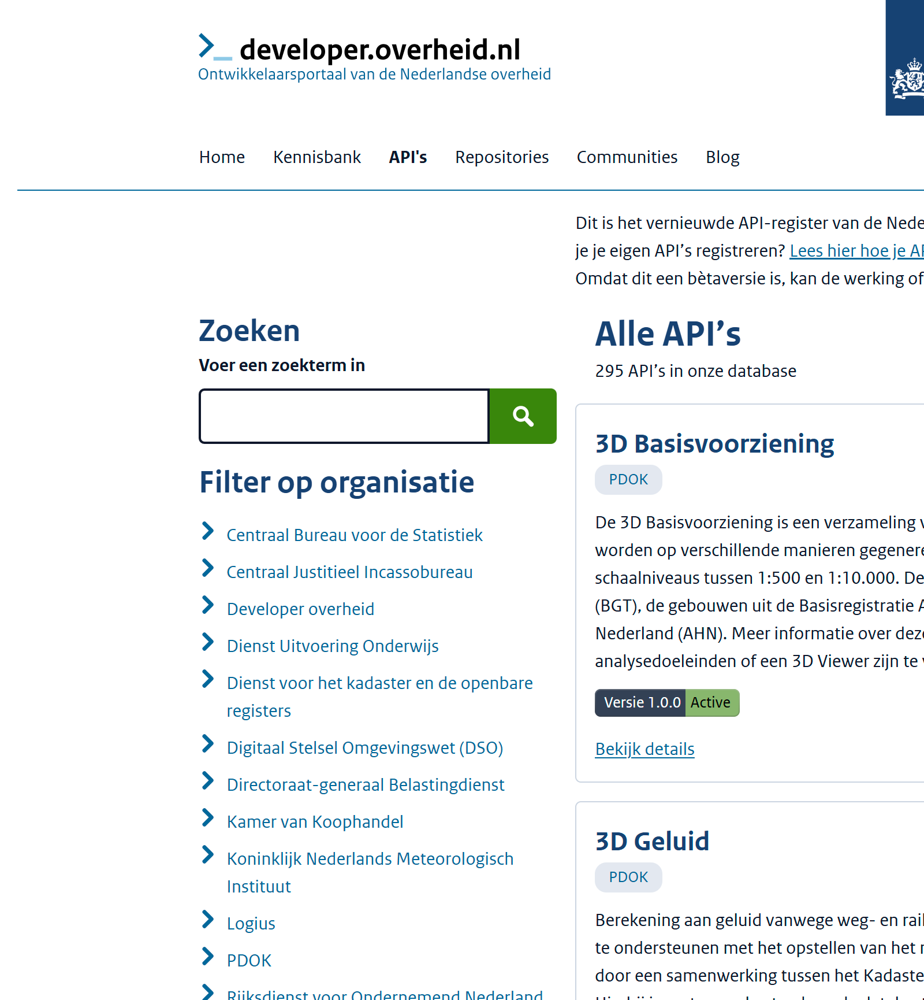
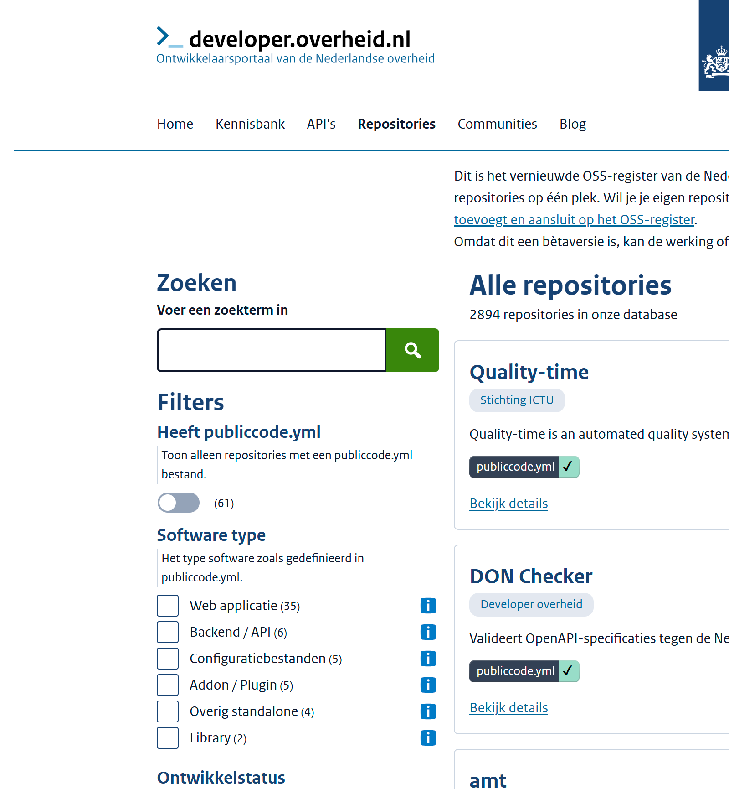
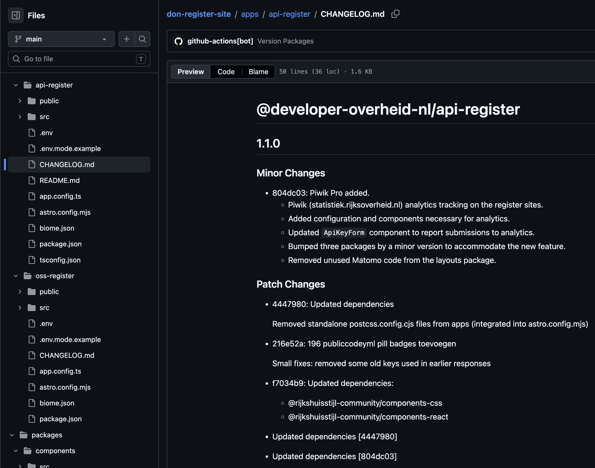

# developer.overheid.nl update
<!-- _class: title -->

## Kennisbank
<!-- Tom -->

- Herindeling hoofdthema's
- Tags
- Extra ingang: `content_type`

## Bijdragen
<!-- Tom -->

- Artikelen
- Blog
- Workflow

## Register-sites
<!-- Jaap-Hein -->

- Architectuur
  - [Astro](https://astro.build/): Structuur, routing, SSR/SSG, Markdown.
  - [Rijkshuisstijl community components](https://www.rijkshuisstijl-community.nl/): React component library op basis van NL Design System; [OpenAPI TypeScript](https://openapi-ts.dev/): Type declarations & fetch; [i18Next](https://www.i18next.com/): internationalization; [Biome](https://biomejs.dev/): formatting, linting and assist.
  - Monorepo; Aantal packages worden gepubliceerd op NPM.
- Register Site Template
  - https://github.com/developer-overheid-nl/register-site-template 
  - Alleen een front-end van de register sites om te clonen.
  - Maakt gebruik van de gepubliceerde packages.
- Hergebruik door DSO, Justid, RVO

---

[nieuwe filters](https://oss.developer.overheid.nl/)

## Changelogs
<!-- Matthijs -->

- Aanleiding
  - Meer hergebruik en open source betekent ook strakker versioneren en releasen.
- Onderzoek
  - Vergelijking van [Changesets](https://github.com/changesets/changesets) en [Changie](https://changie.dev/).
  - Beide tools helpen wijzigingen per app of package vast te leggen.
- Resultaat
  - Consistentere release-notes en een beter onderhoudbare `CHANGELOG.md`.
  - Voorbeeld: changelog per app, zoals bij `api-register`.
<!-- Voorbeeld: https://github.com/developer-overheid-nl/don-register-site/blob/main/apps/api-register/CHANGELOG.md -->

## Changelog voorbeeld

`api-register`: changelog per app

## API's
<!-- Matthijs -->

- Infrastructuur
  - APISIX - Keycloak - Open Policy Agent (OPA).
  - Autorisatielogica is uit custom APISIX plugin gehaald en als policy in OPA ondergebracht.
- Flow
  - Trusted client
  - Untrusted client
- Waarom
  - Minder maatwerk in APISIX.
  - Beter beheerbaar en toekomstvast.

---

- Volgende stap
  - APISIX-routing as code.
- API-key aanvragen
  - `Untrusted client`: via [key-aanvragen](https://apis.developer.overheid.nl/apis/key-aanvragen).
  - `Trusted client`: via [developer.overheid@geonovum.nl](mailto:developer.overheid@geonovum.nl) met contactgegevens en organisatie.

## Nieuwe checker
<!-- Dimitri -->

- Architectuur
- CLI
- Severities
- YAML support

## Schema-register
<!-- Dimitri -->

- OpenAPI 3.1
- Herbruikbare JSON Schema's
- Herbruikbare OAS components
- Schema Design Rules
- JSON-LD
- Nieuwe werkgroep: <d.vanhees@geonovum.nl>

## Publiccode.yml
<!-- Tom -->

- Nieuwste versie
- Known issues
- Verbeteren dmv AI

## AI Skills
<!-- Tom -->

- Disclaimer
- Anthrophic standaard

## Fysieke bijeenkomst
<!-- Tom -->

- Woensdag 17 juni
- Beatrixtheater, Utrecht
- Demo's
- Roadmap tweede halfjaar
- Save the dates: 9 & 10 juni: FOST (fka API Days) Amsterdam
