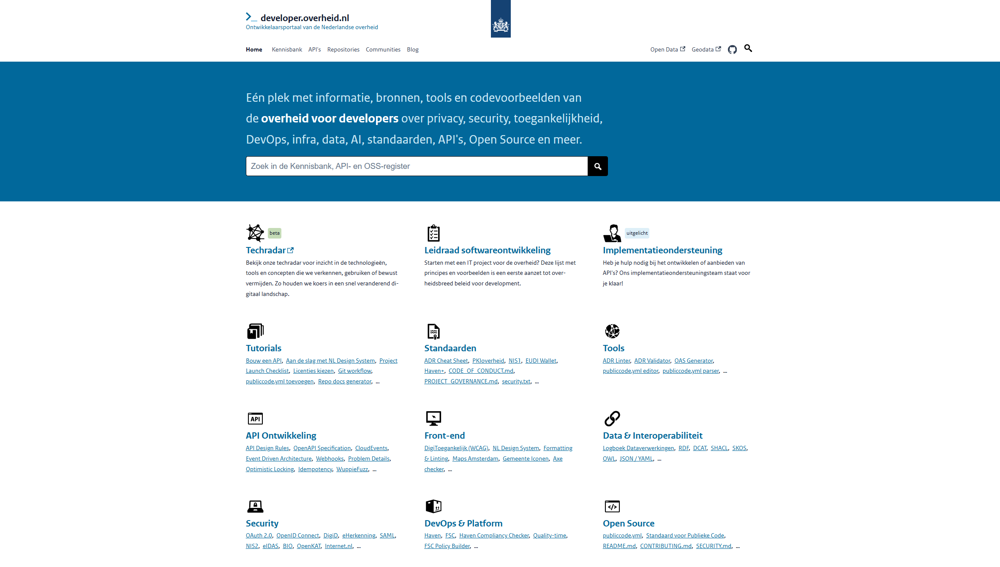
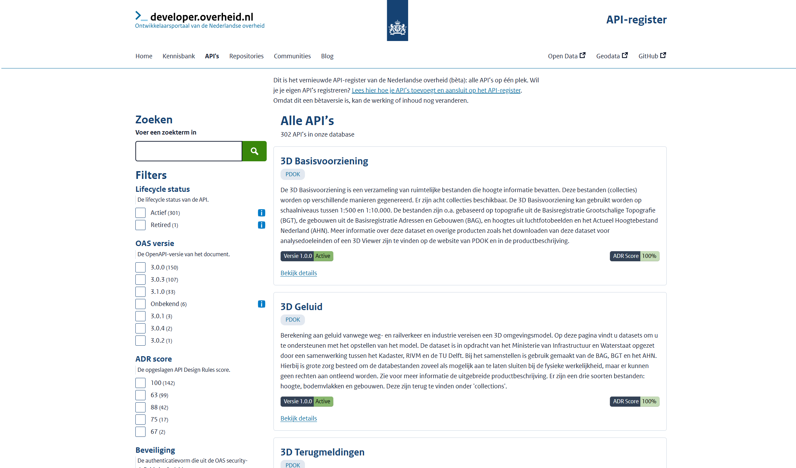
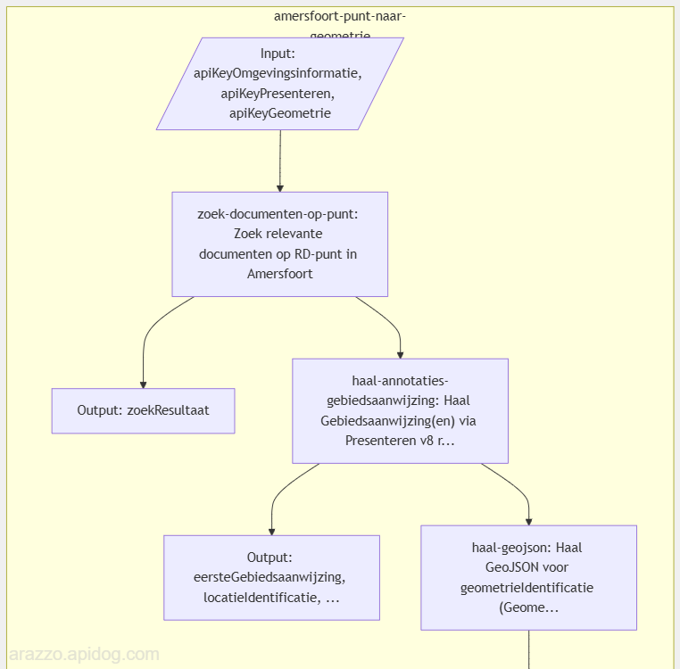
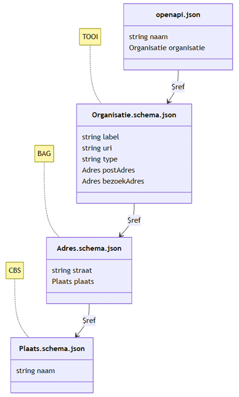
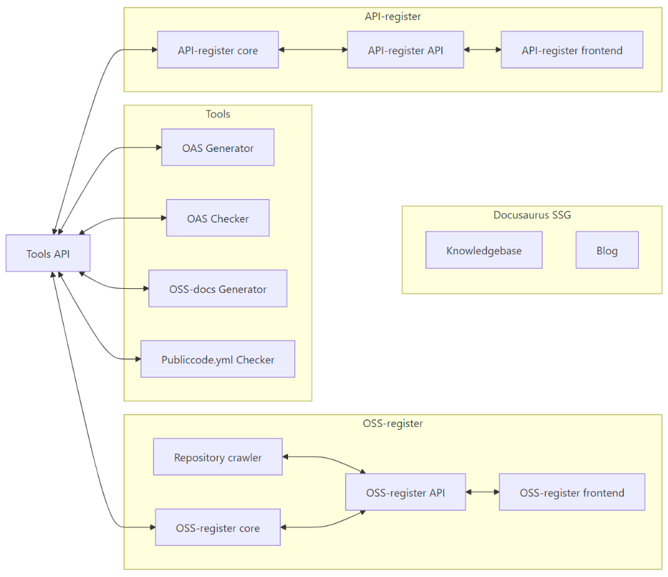

# developer.overheid.nl x DSO-LV

<!-- _class: title -->

Dimitri van Hees
<d.vanhees@geonovum.nl>

Sebastian Mennes
<sebastian.mennes@kadaster.nl>

## Developer portal
<!-- _class: title -->

## Developer portal

- "A developer portal provides a central place for developers to discover and use services."
- "To be clear, **it's not simply an API catalog**. It comprises more than a list of API specs and documentation."
- "It's a **central place for developers to go and learn** about the systems that they work on and interact with."
- "It provides **self-service tools** to get devs integrated quickly and easily."
- "And it gives folks **a place to go when they have questions**."

https://www.opslevel.com/resources/developer-portals-what-are-they-and-why-do-you-need-them

## Developer Experience (DX)
<!-- _class: title -->

## developer.overheid.nl
<!-- _class: title -->

## don img
<!-- _class: image -->



## developer.overheid.nl

- Kennisbank
- Blog
- Tools
- Open Source register
- API register

## Tools

- OAS generator
- OAS checker
- OAS converter (3.0 to 3.1 en vice versa)
- Design rules code templates
- OSS docs generator
- publiccode.yml checker

## API register
<!-- _class: title -->

## api-register img
<!-- _class: image -->



## Verplichte standaarden

- OpenAPI Specification (OAS)
- REST API Design Rules (ADR)

## OpenAPI-first

- Contact info
- Environments
- Security
- Examples
- JSON Schemas

## API Lifecycle
<!-- _class: title -->

## API Lifecycle "End-of-Life" phase


## Geen standaard, wél API register extensie

```yaml
openapi: 3.0.3
info:
  version: 1.2.3
  x-deprecated: 2025-10-10 # toekomst of verleden
  x-sunset: 2027-11-11     # altijd in de toekomst
```

## Arazzo
<!-- _class: title -->

## Arazzo support

- Arazzo als functionele documentatie per API
- Arazzo als functionele documentatie van samenhangende API's (DSO)
- Visualisaties
- Software Development Kits (SDK's)
- Integratietests

## Arazzo syntax

```yaml
arazzo: 1.0.1
info:
  title: Title
  summary: Summary
  version: 0.0.1
sourceDescriptions:
  - name: productApi
    url: http://localhost:8080/product-api/v1/openapi.json
    type: openapi
workflows:
  - workflowId: buyProduct
    steps:
      - stepId: getProduct
        operationId: $sourceDescriptions.productApi.getProduct
      - stepId: addToCart
        operationId: $sourceDescriptions.productApi.addToCart
```

## Arazzo.png
<!-- _class: image -->


## JSON Schemas
<!-- _class: title -->

## schemas img
<!-- _class: image -->



## Schema register

- Discoverability
- Reusability
- Versioning
- Documentation
- Codegen van types, classes, etc.
- Schema Design Rules

## Project landschap
<!-- _class: title -->

## HLA
<!-- _class: image -->


## Losse repositories

- Makkelijker te hergebruiken
- Makkelijker te managen
- Makkelijker aan te contributen
- "Mix & Match"

## Mix & Match
<!-- _class: image -->

