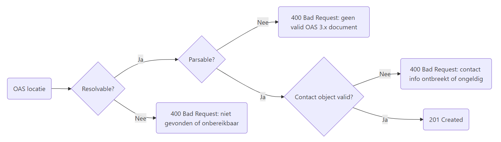
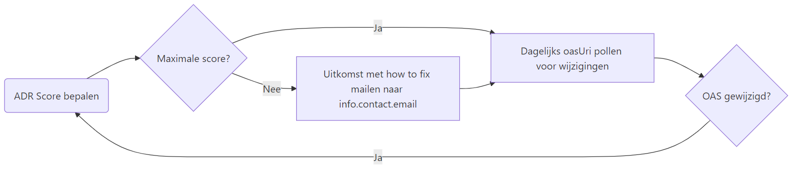

# Het nieuwe API register
<!-- _class: title -->

Dimitri van Hees
<d.vanhees@geonovum.nl>

## Uitgangspunten

- REST-only
- OpenAPI-first
- API-first
- Open Source

## REST-only
<!-- _class: title -->

## Huidige API register

- REST/JSON (113)
- REST/XML (27)
- OData (4)
- WFS (3)
- WMS (1)
- GraphQL (1)
- CKAN (1)
- Atom (1)
- Socrata (1)

## JSON/XML

- **REST/JSON (113)**
- **REST/XML (27)**
- OData (4)
- WFS (3)
- WMS (1)
- GraphQL (1)
- CKAN (1)
- Atom (1)
- Socrata (1)

## OData

- **REST (140)**
- **OData (4)** = REST
- WFS (3)
- WMS (1)
- GraphQL (1)
- CKAN (1)
- Atom (1)
- Socrata (1)

## Geo API's

- **REST (144)**
- **WFS (3)** ➔ OGC API = REST
- **WMS (1)** ➔ OGC API = REST
- GraphQL (1)
- CKAN (1)
- Atom (1)
- Socrata (1)

## Overige API's (2,6%)

- **REST (148)**
- ~~GraphQL (1)~~
- ~~CKAN (1)~~
- ~~Atom (1)~~
- ~~Socrata (1)~~

## OpenAPI-first
<!-- _class: title -->

## Verplichte standaarden

- OpenAPI Specification (OAS)
- REST API Design Rules (ADR)

## Uit te drukken in OAS

- Contactinformatie (`info.contact` vanaf ADR 2.1)
- Security schemes (`mTLS` vanaf OAS 3.1)
- Example(s vanaf OAS 3.1) voor mocking en code generatie
- Environments (`servers`-array, nog niet in ADR)

## Niet in OAS

- SLA info
- Thema's
- Organisatie
- Code repository
- API lifecycle info

## Organisatie - oude situatie

- Hard gekoppeld aan Register van Overheidsorganisaties (ROO)
- Via eigen API die content dupliceert
- Gouden API winnaar "SURF" staat niet in ROO; API kan niet naar register
- Iedereen kan API's toevoegen namens een organisatie

## Organisatie - nieuwe situatie

- Uitfasering eigen API
- Identificatie o.b.v. credentials
- Gekoppeld aan TOOI (waar mogelijk)
- Uitzondering voor organisaties buiten ROO

## TOOI API

- Gemeente Utrecht: <https://identifier.overheid.nl/tooi/id/gemeente/gm0344>
- API resource: <https://api.standaarden.overheid.nl/v1/overheidsorganisaties/https%3A%2F%2Fidentifier.overheid.nl%2Ftooi%2Fid%2Fgemeente%2Fgm0344>
- Adressen: <https://api.standaarden.overheid.nl/v1/overheidsorganisaties/https%3A%2F%2Fidentifier.overheid.nl%2Ftooi%2Fid%2Fgemeente%2Fgm0344/adressen>
- Caching versus "Data bij de Bron"...


## ADR Validator


## Aanleverprocedure



## API toevoegen

```json
// POST https://api.developer.overheid.nl/apis HTTP/1.1
// Content-Type: application/json

{
  "oasUri": "https://api.standaarden.overheid.nl/v1/openapi.json"
}
```

## Geen `info.contact` in OAS gevonden

```json
// HTTP/1.1 400 Bad Request
// Content-Type: application/problem+json

{
  "type": "https://apis.developer.overheid.nl/12345/spec#400",
  "title": "Bad Request",
  "status": 400,
  "detail": "Contact info kan niet uit OAS gehaald worden",
  "invalidParams": [
    {
      "name": "contact.name",
      "reason": "Ontbreekt"
    },
    {
      "name": "contact.email",
      "reason": "Ontbreekt"
    },
    {
      "name": "contact.url",
      "reason": "Ontbreekt"
    },
  ]
}
```

## API toevoegen, poging 2

```json
// POST https://api.developer.overheid.nl/apis HTTP/1.1
// Content-Type: application/json

{
  "oasUri": "https://api.standaarden.overheid.nl/v1/openapi.json",
  "contact": {
    "name": "TOOI API Team",
    "email": "developer.overheid@geonovum.nl",
    "url": "https://github.com/developer-overheid-nl/issues"
  }
}
```

## API toegevoegd

```json
// HTTP/1.1 201 Created
// Content-Type: application/json
// Location: https://api.developer.overheid.nl/apis/12345

{
  "id": "12345",
  "oasUri": "https://api.standaarden.overheid.nl/v1/openapi.json",
  "title": "TOOI API",
  "description": "Dit is de TOOI API",
  "contact": {
    "name": "TOOI API Team",
    "email": "developer.overheid@geonovum.nl",
    "url": "https://github.com/developer-overheid-nl/issues"
  }
  "adrScore": null
}
```

## Vervolgstappen



## Wijziging forceren

```json
// PUT https://api.developer.overheid.nl/apis/12345 HTTP/1.1
// Content-Type: application/json

{
  "oasUri": "https://api.standaarden.overheid.nl/v1/openapi.json",
}
```

## `oasUri` is unieke identifier van de API

- `oasUri` bevat het endpoint inclusief major version (ADR `/core/publish-openapi`)
- `oasUri` wijzigen: nieuwe API toevoegen en oude API verwijderen
- API verwijderen: contact opnemen om oude te laten verwijderen
- Dit omdat een API niet zomaar "verwijderd" kan worden; dit is een lifecycle wijziging

## API Lifecycle

1. Active
1. Deprecated (wordt uitgefaseerd, geen ondersteuning)
1. Sunset (uitgefaseerd, offline)

## RFC9745: The Deprecation HTTP Response Header Field

```http
Deprecation: @1688169599
Sunset: Sun, 30 Jun 2024 23:59:59 UTC
Link: <https://developer.example.com/deprecation>;
     rel="deprecation"; type="text/html"
```

<https://datatracker.ietf.org/doc/html/rfc9745>

## Voorstel

```yaml
openapi: 3.0.0
info:
  version: 1.2.3
  x-deprecated: 2025-10-10 # toekomst of verleden
  x-sunset: 2027-11-11 # altijd in de toekomst
```

<https://github.com/Geonovum/KP-APIs/issues/649>

## Servers

## OpenAPI Overlays

## OpenAPI 3.1

## API scores

- Meta gegevens laten vallen
- TLS -> tonen bij ADR, dus nog maar één score
- Validator draaien bij wijziging of toevoeging OAS

## Extra features

- Embedded Discourse comments in eigen tab
- Mocking data, SDK’s, Bruno collections, etc.
- Views beschikbaar als webcomponents
- WCAG compatible "ReDoc"?
