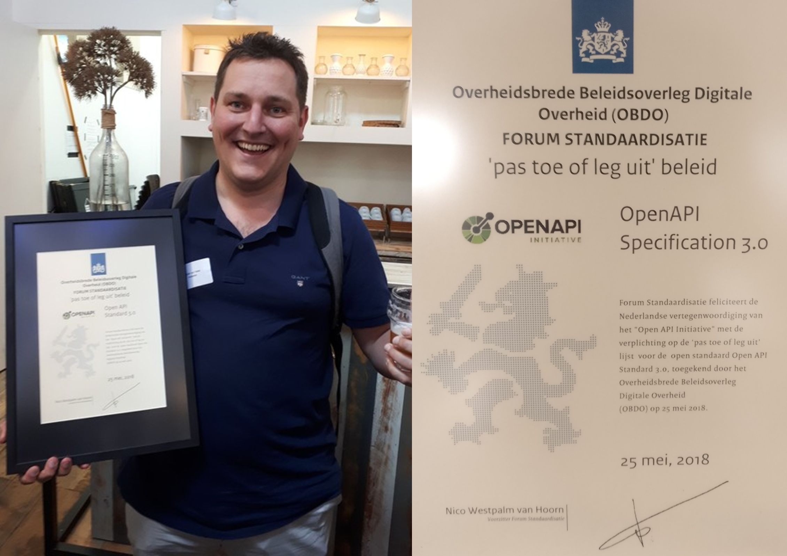
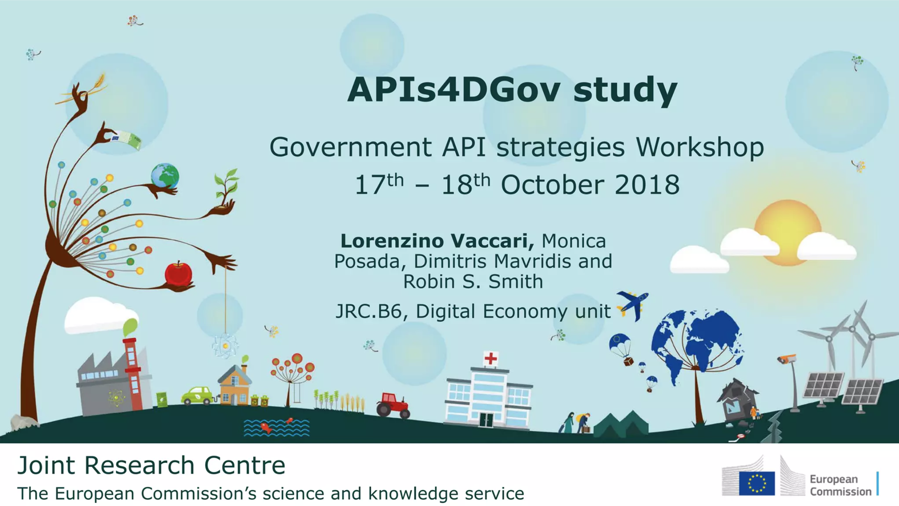
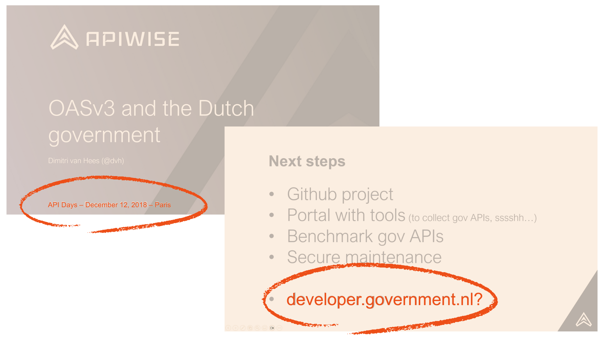
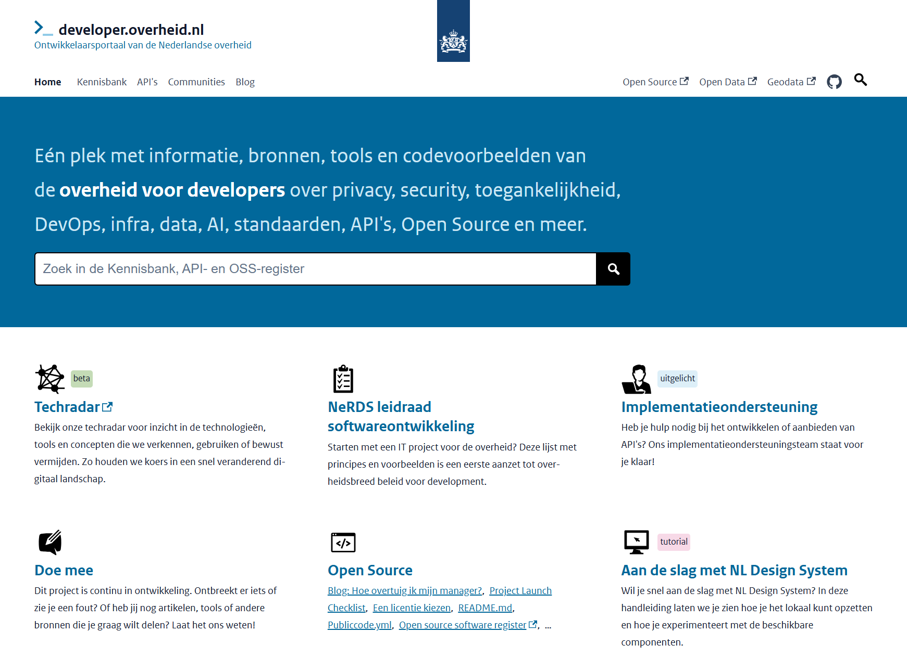
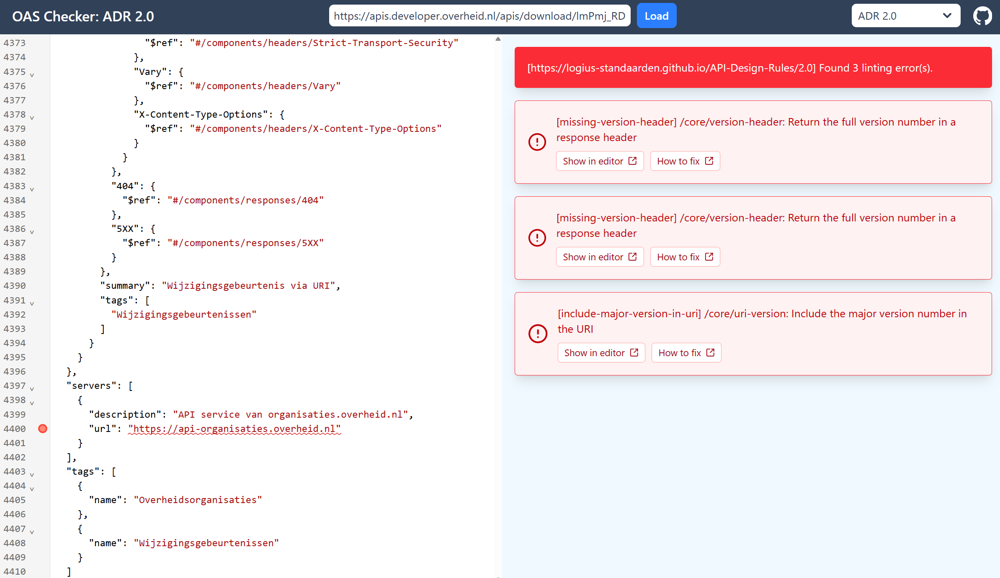
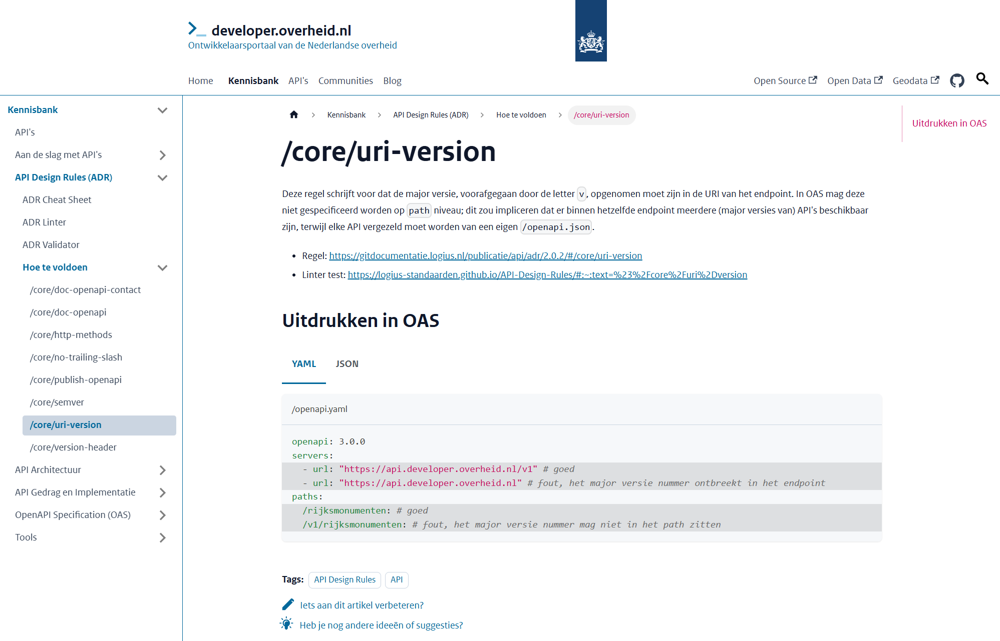
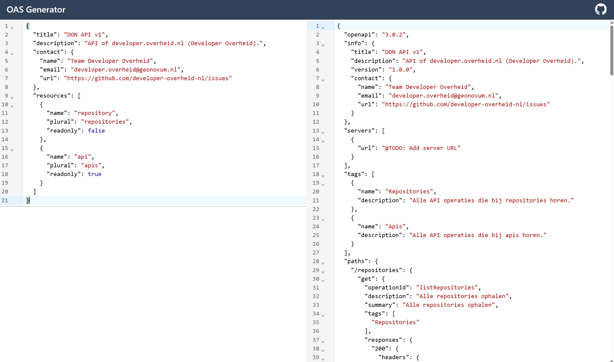
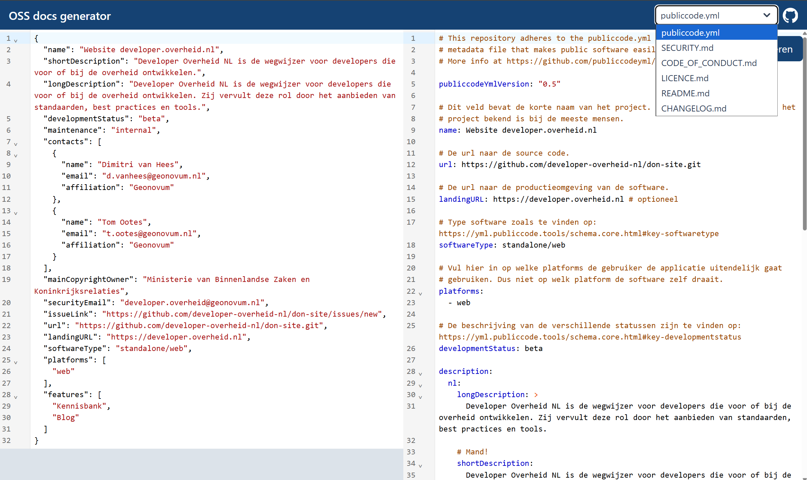
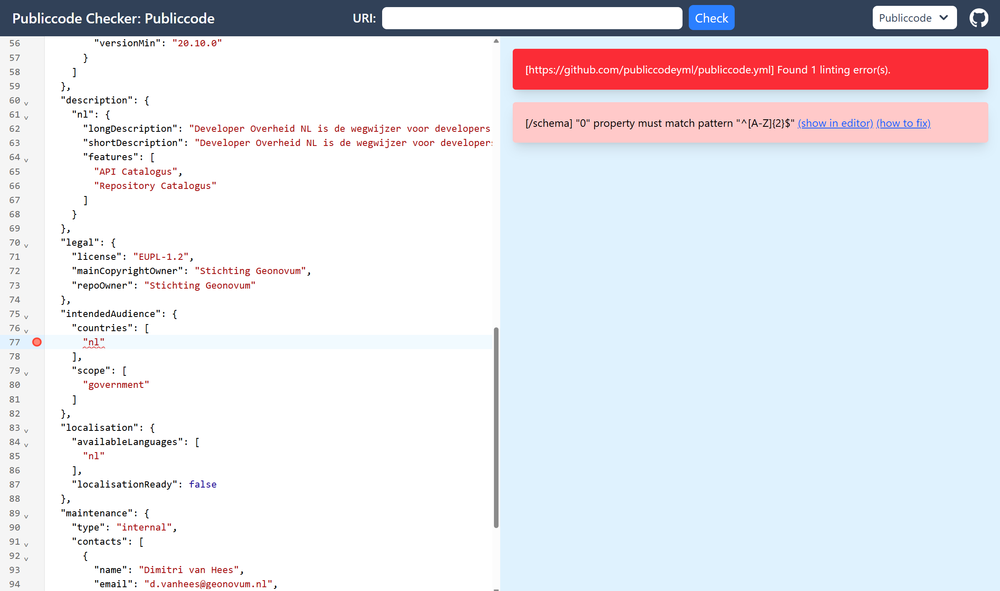

# How the Dutch Government uses an OpenAPI-first approach to leverage Developer Experience
<!-- _class: title -->
<br/>

Dimitri van Hees
API Days Paris
December 11, 2025

## Introduction
<!-- _class: image -->


<!-- Feels like coming home, little recap
- Api journy started in 2013, second api days Paris
- June 2018: openapi mandatory
- Step 1: standardize the way we describe APIs: OpenAPI Specification
 -->

## Italy
<!-- _class: image -->
<!-- 
- October 2018, call from Mehdi
- 4 Dutch organisations were representing The Netherlands
- Embarrased, but there is no "agency" or "ministry" of IT or Digital Services here
- All decentralized
- Pizza and beer with Italian and Dutch colleagues: birth of National Developer Portal
-->


## Apidays2018


<!-- _class: image -->
<!--
- Last time I spoke here; tomorrow exactly 7 years ago 
- 2020: COVID: done with gov
- 2023: Back to bring developer portal to next level
-->

## developer.overheid.nl<br/>(dev.gov.nl)
<!-- _class: title -->

## homepage
<!-- _class: image -->


## IT acceleration in The Netherlands

- Serious incidents with local copies
- "Data at the source" principle
- Prevent local copies

## Trump
<!-- _class: image -->


## IT acceleration in The Netherlands (and Europe!)

- Serious incidents with local copies
- "Data at the source" principle
- Prevent local copies
- Digital Autonomy top priority in EU
- Dutch National Digital Strategy launched last july

## The new API Register
<!-- _class: title -->

## OpenAPI-first

- 140 REST(ish/ful)
- 100 Geo-services (WFS/WMS)
- 4 OData
- 1 GraphQL
- 3 Other (Atom, CKAN, Socrata)

## OpenAPI-first
<!-- 244 OpenAPI specs, 254 now -->

- 140 REST(ish/ful)
- 100 Geo-services (WFS/WMS) -> OGC API = REST(ish/ful)
- 4 OData = REST(ish/ful)
- ~~1 GraphQL~~
- ~~3 Other (Atom, CKAN, Socrata)~~

## How it works

1. `POST` URL of the OAS document to our _API register API_
1. Validate OAS and presence of `contact` object
1. If valid, add URL to register
1. Make local copy of dereferenced OAS
1. Convert 3.0 to 3.1 and vice versa
1. Convert YAML to JSON and vice versa
1. Generate cool stuff (SDKs, Bruno, Postman, etc.)
1. Validate API Design Rules to calculate score
1. Poll for changes. If change detected: return to step 4

## API Design Rules (ADR)
<!-- _class: title -->
<!--
- We can’t centralize legislation, but we can centralize the way gov APIs should work
- Discussions about versioning, pagination. Body or header links? Toss a coin.
- Dont care HOW but that we do it all the SAME.
- Mandatory standard
-->

## API Design Rules (ADR)

- It doesn't matter HOW we do it, as long as we all do it the SAME
- Possibility to generate generic tooling
- Saves discussion time
- Changes can be fixed by following the same migration path and tutorials
- Generic tooling can follow ADR versions
- Better Developer Experience for API devs

<!-- 
Better for generic tooling, saves discussion, and last but not least: if we find that it should have been different in a next version of the api design rules, we can all follow the same migration path and documentation; generic tooling stays intact when updated to next major version
Mostly refered to client developers, devs consuming the API's.
In this talk also refered to API devs.
-->

## ADR validation with Spectral (docs.stoplight.io/docs/spectral)

<!--
- Spectral ruleset
- Alternative: vacuum
- Validation against OAS (not runtime)
-->

```yaml
extends: spectral:oas
rules:
  missing-version-header:
    severity: error
    given: $..[responses][?(@property && @property.match(/(2|3)\d\d/))][headers]
    then:
      field: API-Version
      function: truthy
    message: "/core/version-header: Return the full version number in a response header."
  include-major-version-in-uri:
    severity: error
    given:
      - "$.servers[*]"
    then:
      function: pattern
      functionOptions:
        match: "\\/v[\\d+]"
      field: url
    message: "/core/uri-version: Include the major version number in the URI."
```

## OAS Checker.png
<!-- _class: image -->


## Howtofix.png
<!-- _class: image -->


## Impact analyses for new rules
<!-- _class: title -->

## application/problem+json

```json
{
  "status": 400,
  "title": "Request validation failed",
  "errors": [{
    "in": "body", // body, query or header
    "location": "#/foo[0]/bar", // JSON pointer
    "code": "date.format",
    "detail": "Must be ISO 8601"
  }]
}
```

## Impact analysis
<!-- Numbers are not actual, simplified for this talk -->
- 70% doesn't return `400` at all
- 15% (50% of 30%) doesn't return `application/problem+json`
- 12% (80% of 50% of 30%) doesn't return `errors` property
- 97% will fail this new API Design Rule

## Compliance monitor
<!-- Again, numbers are not actual -->
- 80% succeeds `/core/version-uri` now (growth of 10% since last month)
- 60% succeeds `/core/openapi-location` now (decrease of 5% since last week)
- Yearly report for Netherlands Standardisation Forum

## API Lifecycle: end-of-life
<!-- _class: title -->

## End-of-life phase


## Versioning and statuses
<!-- DX low when you have to parse runtime headers; what about closed apis? Perhaps we'll do it both, but urge to fix this in openapi, along with the version! -->

- Exploit `info.version` for current semver of the API
- RFC 9745 not suitable; solution at runtime
- We work OpenAPI-first (design-time)
- Workaround: custom extensions

## API register extensions

```yaml
openapi: 3.0.3
info:
  version: 1.2.3
  x-deprecated: 2025-10-10 # future or past
  x-sunset: 2027-11-11     # future. If past, status is retired
```

## API statuses

- `Active`
- `Deprecated`
- `Sunset`
- `Retired` (impossible to `DELETE` an API from the register)
- `To be deprecated` (any suggestions?)

## Arazzo support
<!-- _class: title -->
<!-- 
- Arazzo to Mermaid and Markdown
- Arazzo Tool ported from Lorna Mitchell's Python tool
- Usecase: Digital Department of the Environmental Act
-->

## Arazzo.png
<!-- _class: image -->

<!-- obtaining a permit involves many different APIs -->

## Project landscape
<!-- _class: title -->

## HLA
<!-- _class: image -->


## Separate repositories
<!-- 
- Monorepos are regaining popularity, but
-->
- Easier to reuse
- Easier to manage
- Easier to contribute
- Easier to "mix & match"

## Integrations
<!-- _class: image -->


## Frontend

- Based on NL Design System
- Government branding components
- WCAG compatible
- Aware of API design

## Github style "badges"


## badge preview
<!-- _class: image -->


## OAS Generator
<!-- _class: image -->


## Reusable ADR schemas and components
<!-- schema register (based on DVLA presentation last year) -->
- @TODO: JSON Schema register
- @TODO: Update standard to OAS 3.1 or 3.2

## Tools API

- Convert OAS 3.0 to OAS 3.1
- Convert OAS 3.1 to OAS 3.0
- Validate OAS against ADR
- Bundle OAS to single file
- OAS to Postman collection
- Arazzo to Markdown
- Arazzo to Mermaid

## Open Source Software (OSS) register
<!-- _class: title -->

## Publiccode.yml

- OAS for OSS projects in the public sector
- Collab EU, italy, brussels

## OSS-docs generator
<!-- _class: image -->


## Publiccode.yml Checker
<!-- _class: image -->


## Next steps

- Stable and compliant landscape
- Notifications (RSS?)
- Schema register
- Launching customer of code.overheid.nl (code.gov.nl)
- MCP

## Thank you!
<!-- _class: title -->
<br/><br/>
Dimitri van Hees
E-mail: <d.vanhees@geonovum.nl>
LinkedIn: <https://www.linkedin.com/in/dimitrivanhees/>
Slides: <https://dvh.github.io/slideshows/apidays-paris>
Github: <https://github.com/developer-overheid-nl>
