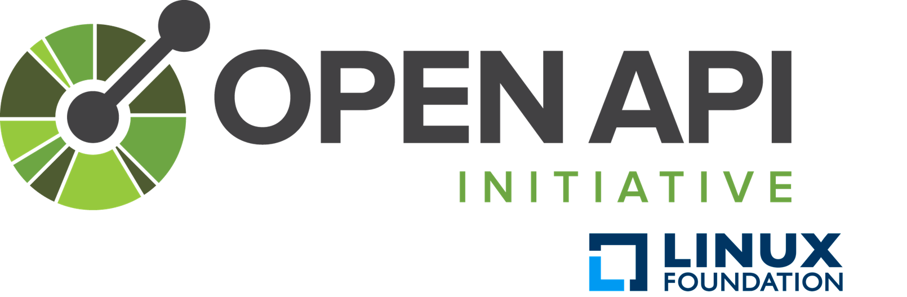
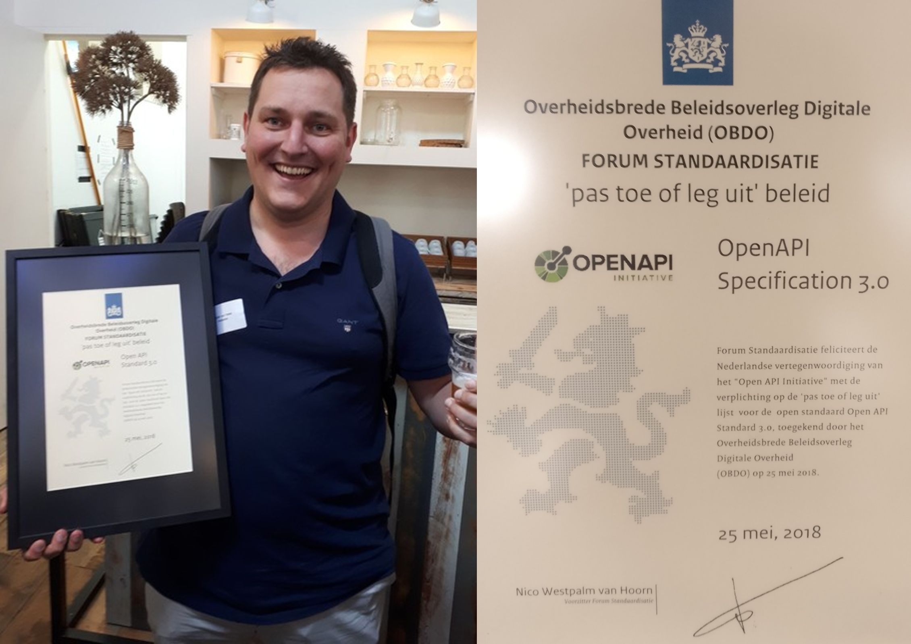
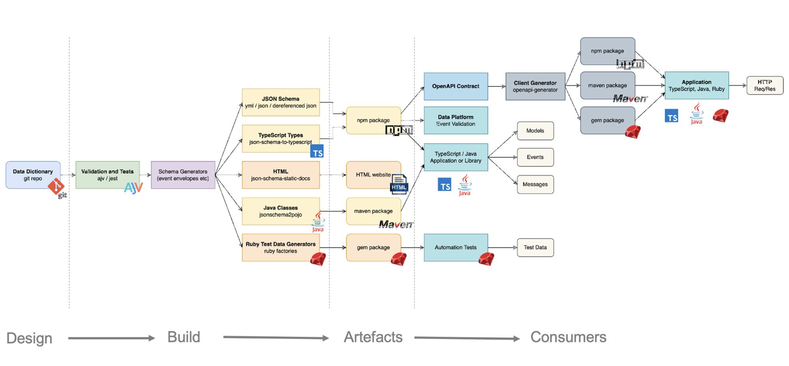

# OpenAPI Specification
<!-- _class: title -->

Dimitri van Hees
<d.vanhees@geonovum.nl>

## REST-ful/ish API

HTTP/web interface/API die aan veel, maar niet alle, principes van REST voldoet. 

## API Spec(ification)

Beschrijft het 'contract' tussen een API en een client. Hierin staat hoe welke operaties gedaan kunnen worden, beveiligingsprotocollen, ondersteunde gegevensformaten, etc. Vergelijkbaar met WSDL voor SOAP.

## API Reference

Human-readable variant van de API Spec. Naast tutorials en andere niet-technische informatie onderdeel van de API Docs welke te vinden is op een API/Developer Portal (soms ook wel API Store genoemd). 

## API Specification frameworks

- Swagger (Smartbear)
- RAML (Mulesoft)
- API Blueprint (IBM)

## Swagger

```yaml
swagger: "2.0"
info:
  title: Beer API
  description: Beer API for demo purposes.
  version: 1.0.0
schemes:
  - https
consumes:
  - application/json
produces:
  - application/json
parameters:
  id:
    name: id
    in: path
    description:  Unique ID to identify a beer.
    required: true
    type: string
paths:
  /beers/{id}:
    get:
      summary: Retrieve a single beer
      description: With this call the client can retrieve a single beer.
      parameters:
        - $ref: "#/parameters/id"
      responses:
        200:
          description: Representation of the single beer.
          schema:
            $ref: "#/definitions/Beer"
```

## RAML

```yaml
#%RAML 1.0
---
title: Beer API
description: Beer API for demo purposes.
version: 1.0.0
/beers:
  /{id}:
    get:
      description: With this call the client can retrieve a single beer.
      responses:
        200:
          body:
            application/json:
              example: |
```

## API Blueprint

```markdown
FORMAT: 1A

# Beer API
Beer API for demo purposes.

## API Blueprint

# GET /beers
+ Response 200 (application/json)
```

## Machine-readable
<!-- _class: title -->

## Automatisch gegenereerde:

- References
- Tests
- Developer SDK's
- Validators
- Server code
- Gateway configuraties
- Etc.

## Populariteit

|Framework|Community|
|-|-|
|Swagger|🙌🙌🙌🙌🙌🙌🙌🙌🙌🙌🙌🙌🙌🙌🙌🙌🙌🙌🙌🙌🙌🙌🙌🙌|
|RAML|🙌🙌🙌🙌🙌🙌🙌🙌🙌|
|API Blueprint|🙌🙌🙌|

## Tadaaaaaaaaaaa!



## OpenAPI Specification (OAS) 3

- Gebaseerd op Swagger 2.0
- Stable sinds juli 2017
- Volledig Open Source via Github
- Volledig vendor neutraal
- Samenwerking van alle voorheen concurrerende oplossingen

## "OpenAPI becomes the de facto standard in this industry"
<!-- _class: title -->

## PTLO
<!-- _class: image -->



## Kennisplatform API's

- Geonovum
- Kadaster
- KVK
- VNG
- Forum Standaardisatie

## Nieuwe leden

- SVB
- RVIG
- Ministerie van Justitie en Veiligheid
- Informatiehuis Water
- Logius

## Werkgroepen

- API strategie
- Architectuur
- Authenticatie Autorisatie
- Communicatie en Beleid
- Gebruikerswensen

## Volgende bijeenkomst: 5 november

Aanmelden: https://www.geonovum.nl/agenda/kennisplatform-apis-speciale-editie

## NL API Strategie
<!-- _class: title -->

## Verplichte standaarden (pas-toe-leg-uit)

- "Als je een API publiceert, **moet** deze voorzien zijn van een OpenAPI Specification"
- "Als je een API publiceert, **moet** deze voldoen aan de API Design Rules (ADR)"
- Filmpje: https://www.forumstandaardisatie.nl/open-standaarden/openapi-specification

## developer.overheid.nl
<!-- _class: title -->

## Developer portal

- Kennisbank
- Communities
- Blog
- Open Source register
- API register
- Tools

## Tools

- OAS generator
- OAS checker (fka ADR validator)
- OAS converter (3.0 naar 3.1)

## Design-first

1. Genereer de OAS
1. Pas de OAS aan naar jouw usecase
1. Feedback verzamelen en verwerken
1. Check de OAS
1. Mock de API
1. Genereer server code
1. Implementeer business logic

## API register
<!-- _class: title -->

## Focus op REST(ful/ish)

- WMS/WFS -> OGC API = REST
- ODATA = REST

## OAS first

- Contact info
- Environments
- Security
- Example(s) tbv mocking services en SDK’s
- JSON schemas

## JSON Schemas
<!-- _class: title -->

## DVLA
<!-- _class: image -->


## https:\/\/api.developer.overheid.nl/api-register/v1/openapi.json

```json
{
  "/apis/{id}": {
    "parameters": [
      {
        "$ref": "#/components/parameters/id"
      }
    ],
    "get": {
      "responses": {
        "200": {
          "content": {
            "application/json": {
              "schema": {
                "$ref": "https://schemas.developer.overheid.nl/api.json"
              }
            }
          }
        }
      }
    }
  }
}
```

## https:\/\/schemas.developer.overheid.nl/api.json

```json
{
  "$schema": "http://json-schema.org/draft-04/schema#",
  "type": "object",
  "properties": {
      "titel": {
          "type": "string"
      },
      "organisatie": {
        "type": "object",
        "properties": {
          "$ref": "https://schemas.standaarden.overheid.nl/tooi/organisatie.json"
        }
      }
  },
  "required": [
    "titel",
    "organisatie"
  ]
}
```

## https:\/\/schemas.standaarden.overheid.nl/tooi/organisatie.json

```json
{
  "$schema": "https://json-schema.org/draft/2020-12/schema",
  "type": "object",
  "properties": {
    "officieleNaam": {
      "type": "string"
    },
    "verkorteNaam": {
      "type": "string"
    },
    "uri": {
      "type": "string"
    },
    "adres": {
      "type": "object",
      "$ref": "https://schemas.developer.overheid.nl/adres.json"
    }
  }
}
```

## Next up: Arazzo
<!-- _class: title -->

## Op naar één centrale plek voor software development bij de overheid!
<!-- _class: title -->

- Bijdragen: <https://developer.overheid.nl/contributing>
- Mastodon: <https://social.overheid.nl/@developer>
- Slack: <https://codefornl.slack.com/archives/CFV4B3XE2>
- Github: <https://github.com/developer-overheid-nl>
- E-mail: <developer.overheid@geonovum.nl>
