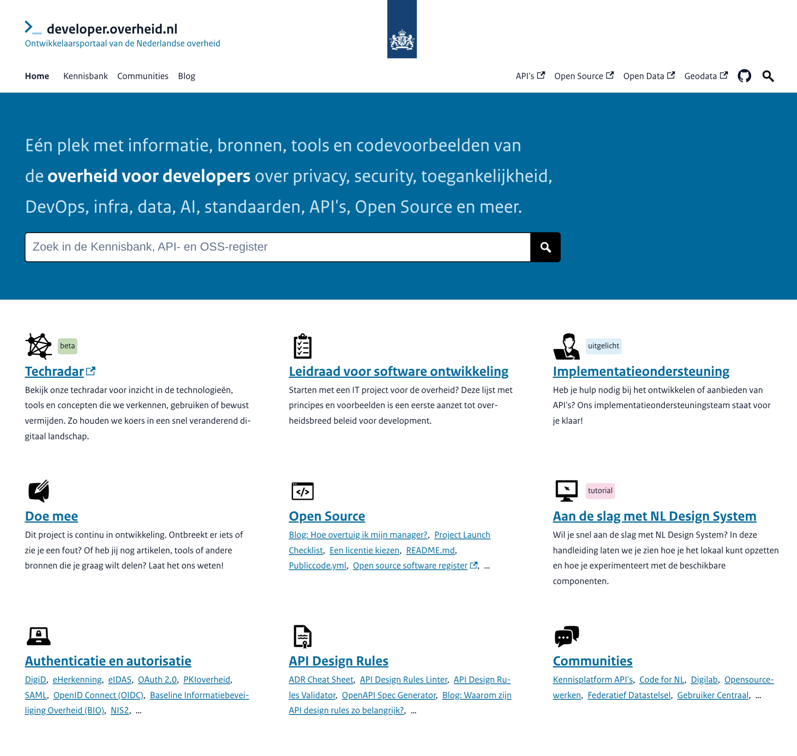
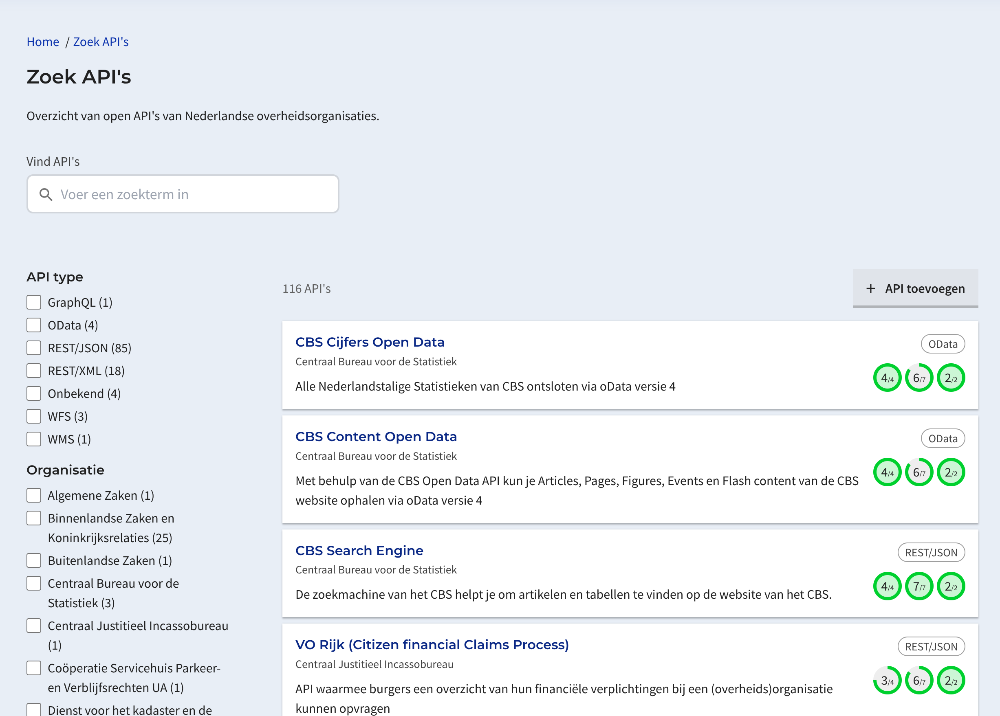
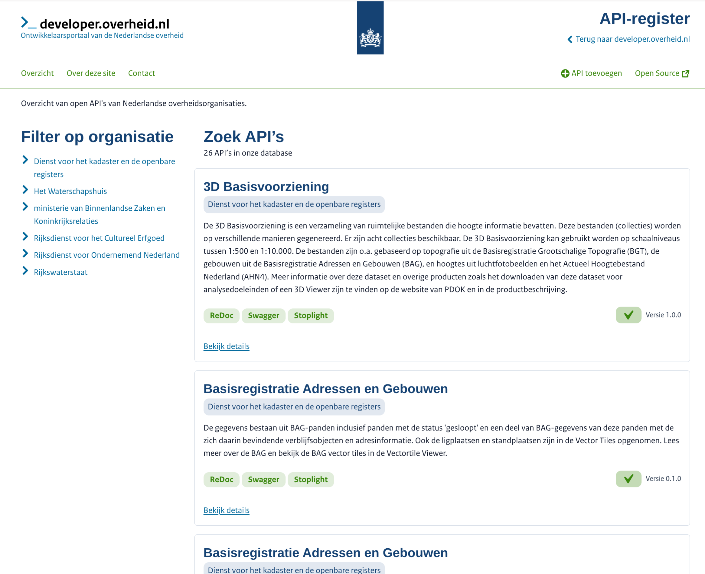
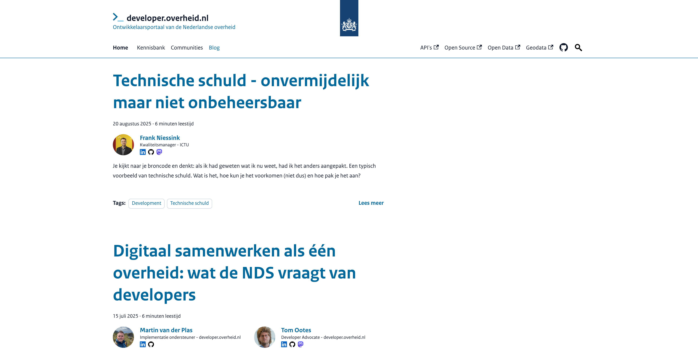

# In vogelvlucht door `developer.overheid.nl`

<!-- _class: title -->

<ul class="horizontal-list" style="margin-top: 3rem;">
  <li>Tom Ootes</li>
  <li>🐘 <a href="https://hostux.social/@tomootes">@tomootes</a></li>
  <li>Gildebijeenkomst  CBS</li>
  <li>8 september 2025</li>
</ul>

## **whoami**

  

      <b>Tom Ootes</b>
      
🙋🏻 Developer Advocate

      
🧰 developer.overheid.nl

      
🎸 Muziek

      
🌳 Biologie

  

  

    
  

<!--
- Im am Tom Ootes
- I work as a freelancer in IT, as a developer
- Ive done a lot of projects for the Dutch Government as a freelancer
- During my work
- As a developer advocate
- Besides this i have a band with which i like to play together
- I also really enjoy reading about biology, and i am a big fan of Alexander von Humboldt, the naturalist and explorer.
-->

##

<!-- _class: title -->
<ul>
  <li>Over ons</li>
  <li>API catalogus</li>
  <li>Open Source catalogus</li>
  <li>Kennisbank</li>
  <li>Oproep</li>
</ul>

## 
<!-- _class: page-image-only -->
 

 

## API catalogus

  <ul>
      <li class="mb-0">Ontdekken van API's</li>
      <li class="mb-0">API documentatie</li>
      <li class="mb-0">Compliancy API Design Rules</li>
      <li>Nieuwe catalogus: OAS first</li>
  </ul>
  

    
  

## Nieuwe API catalogus

  <ul>
      <li>Nieuwe catalogus: OAS first</li>
      <li>API API: end point voor inschieten</li>
      <li>Ondersteuning voor deprecation/ uitfasering</li>
      <li>REST wordt HTTP</li>
  </ul>
  

    
  

## Open Source catalogus

  <ul>
    <li>Bron van voorbeelden</li>
    <li>Bekijk welke organisaties hetzelfde doen</li>
    <li>Op termijn: features en checks</li>
  </ul>
  

    
  

## Nieuwe open source catalogus

  <ul>
    <li>Op basis van publiccode.yml (EU)</li>
    <li>Dependency scanning</li>
    <li>Health check</li>
  </ul>

## Implementatie ondersteuning

<!-- _class: title -->

  
☎️ Joost Farla, Martin van der Plas en Frank Terpstra

## Blog

## Kennisbank: API's
<!-- _class: title -->

<a href="https://developer.overheid.nl/kennisbank/apis">https://developer.overheid.nl/kennisbank/apis</a>

## Kennisbank: Open Source
<!-- _class: title -->
 

<a href="https://developer.overheid.nl/kennisbank/open-source">https://developer.overheid.nl/kennisbank/open-source</a>

## Kennisbank: Front-end
<!-- _class: title -->
 

<a href="https://developer.overheid.nl/kennisbank/front-end">https://developer.overheid.nl/kennisbank/front-end</a>

<!-- _class: title -->

## Dit kunnen jullie doen:

- API's aanmelden voor het API register
- Meld je open source Git repo's aan voor het OSS register
- Voeg een publiccode.yml toe aan je projecten
- Gebruik onze kennisbank!
- Schiet issues in als je iets mist
- Schrijf een gastblog

<!-- _class: title -->

## Bedankt! 🙌

<!-- _class: title -->
<h1 class="pt-0">Vragen?</h1>

### Vind me op

📩 tom@ootes.io

🐘 <a href="https://hostux.social/@tomootes">hostux.social/@tomootes</a>

<!-- _class: title -->
<!-- Hopefully see you again, on the internet? -->
