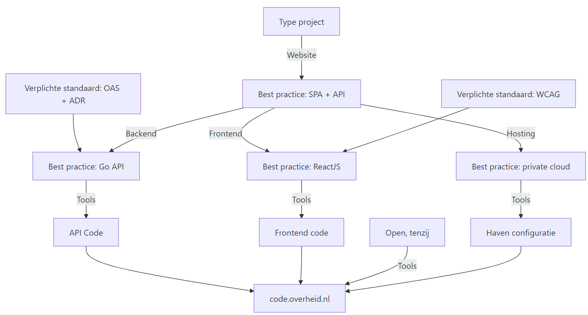

# NeRDS x developer.overheid.nl
<!-- _class: title -->

Dimitri van Hees
<d.vanhees@geonovum.nl>

## Nederlandse Richtlijnen Digitale Systemen (NeRDS)

> Een set standaarden, richtlijnen en praktische hulpmiddelen voor het verantwoord ontwikkelen, inkopen en gebruiken van digitale systemen binnen de Nederlandse overheid.

https://minbzk.github.io/NeRDS/

## Don't reinvent the wheel!
<!-- _class: title -->

## Digitale autonomie begint bij

- Kennis en code borgen
- Kennis en code bundelen
- Kennis en code delen
- Open Source werken
- Standaarden!

## developer.overheid.nl: ontwikkelaarsportaal van de overheid

> Eén plek met informatie, bronnen, tools en codevoorbeelden van de overheid **voor developers** over privacy, security, toegankelijkheid, DevOps, infra, data, AI, standaarden, API's, Open Source en meer.

https://developer.overheid.nl

## Verplichte standaarden

- [OpenAPI Specificatie](https://www.forumstandaardisatie.nl/open-standaarden/openapi-specification) (OAS)
- [REST API Design Rules](https://www.forumstandaardisatie.nl/open-standaarden/rest-api-design-rules) (ADR)

## Tools: van standaard naar code

1. OAS generator (maakt een *boilerplate* OAS)
2. OAS checker (valideert of deze aan de ADR standaard voldoet)
3. Code generator (genereert werkende code op basis van OAS)
4. ADR code templates (ADR *smaakje* voor gegenereerde code)

## Demo
<!-- _class: title -->

## Toekomstige tools

- Haven cloudhosting opspinnen
- Digitoegankelijke front-ends
- Open Source projecten *Open Source Proof* maken
- Beslisboom uitbreiden

## Stip op de horizon
<!-- _class: image -->


## Inzet AI

- Beslisboom via "ChatGPT"
- Standaarden "AI enablen" via Model Context Protocol (MCP)

## API register
<!-- _class: title -->

## Open Source register
<!-- _class: title -->

## Schema register
<!-- _class: title -->

## openapi.yaml

```yaml
/apis/{id}:
  parameters:
    - $ref: "#/components/parameters/id"
  get:
    responses:
      "200":
        content:
          application/json:
            schema:
              $ref: "https://schemas.developer.overheid.nl/api.json"
```

## https:\/\/schemas.developer.overheid.nl/api.json

```json
{
  "$schema": "http://json-schema.org/draft-04/schema#",
  "type": "object",
  "properties": {
      "titel": {
          "type": "string"
      },
      "organisatie": {
        "type": "object",
        "properties": {
          "$ref": "https://schemas.standaarden.overheid.nl/tooi/organisatie.json"
        }
      }
  },
  "required": [
    "titel",
    "organisatie"
  ]
}
```

## https:\/\/schemas.standaarden.overheid.nl/tooi/organisatie.json

```json
{
  "$schema": "https://json-schema.org/draft/2020-12/schema",
  "type": "object",
  "properties": {
    "officieleNaam": {
      "type": "string"
    },
    "verkorteNaam": {
      "type": "string"
    },
    "uri": {
      "type": "string"
    },
    "adres": {
      "type": "object",
      "$ref": "https://schemas.developer.overheid.nl/adres.json" // enz.
    }
  }
}
```

## Help mee

- Kennisbank artikelen
- Interviews
- Pull requests
- Feature requests
- Ideeën

## Op naar één centrale plek voor software development bij de overheid!
<!-- _class: title -->

- Bijdragen: <https://developer.overheid.nl/contributing>
- Mastodon: <https://social.overheid.nl/@developer>
- Slack: <https://codefornl.slack.com/archives/CFV4B3XE2>
- Github: <https://github.com/developer-overheid-nl>
- E-mail: <developer.overheid@geonovum.nl>
