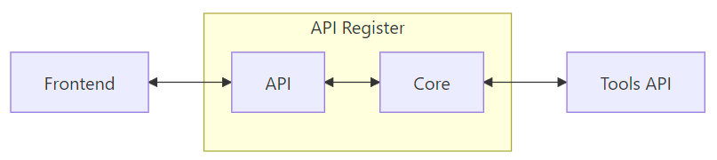
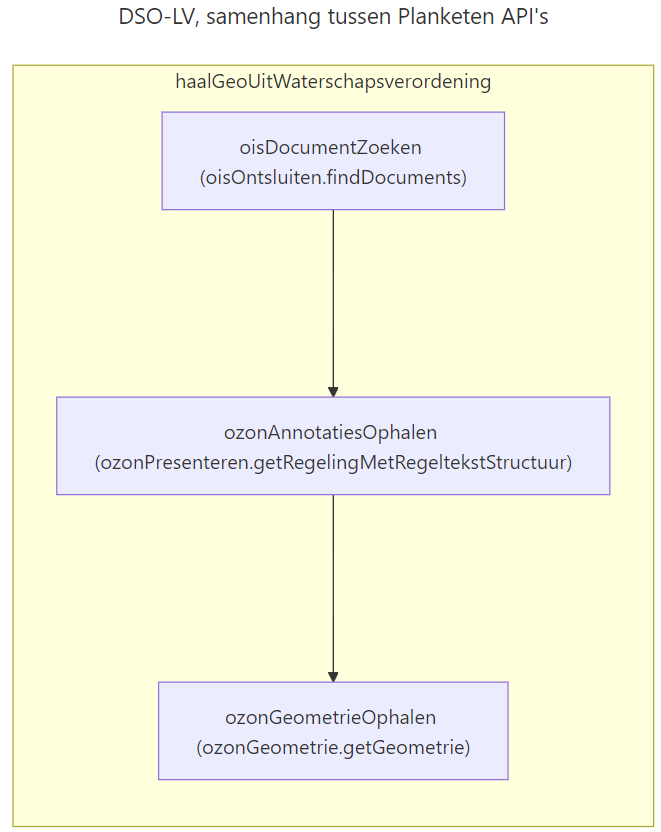

# Het nieuwe API-register
<!-- _class: title -->

Dimitri van Hees
<d.vanhees@geonovum.nl>

## Uitgangspunten

- RESTful/ish/HTTP-only
- OpenAPI-first
- API-first
- Open Source

## Release early, release often!
<!-- _class: title -->

## API-first

- Start met je API
  - Design-first
  - Code-first
- Dan de andere applicatie(s)
  - Frontend
  - Mobile
  - Etc.

## Architectuur



## Nieuwe of gewijzigde API

1. Valideer request + parse OAS (check `contact`)
2. API opslaan
3. OAS conversies via Tools API
4. ADR validate 3.0-versie (via Tools API)
5. Generate Bruno-collectie (via Tools API)
6. Generate Postman-collectie (via Tools API)

## OAS conversies

- 3.0 -> 3.1
- 3.1 -> 3.0
- YAML -> JSON
- JSON -> YAML
- Resolvable kopieën

## Demo
<!-- _class: title -->

## Frontend

- Astro (React, Angular, etc.)
- NL Design System
- Rijkshuisstijl Community

## API Lifecycle
<!-- _class: title -->

## End-of-life


## API register extensions

```yaml
openapi: 3.0.3
info:
  version: 1.2.3
  x-deprecated: 2025-10-10 # toekomst of verleden
  x-sunset: 2027-11-11     # toekomst
```

## API lifecycle badges


## ADR Score
<!-- _class: title -->

## ADR score badge


## PDOK-koppeling

- <https://api.pdok.nl>
- OGC API's

## DCAT-koppeling

- DCAT-AP-NL 3.0
- data.overheid.nl
- Nationaal Georegister

## DCAT-koppeling

- DCAT-AP-NL 3.0
- data.overheid.nl
- Nationaal Georegister -> data.overheid.nl
- PDOK -> Nationaal Georegister

## dataservice.ttl

```bash
@prefix dct: <http://purl.org/dc/terms/> .
@prefix dcat: <http://www.w3.org/ns/dcat#> .
@prefix rdf: <http://www.w3.org/1999/02/22-rdf-syntax-ns#> .
@prefix vcard: <http://www.w3.org/2006/vcard/ns#> .

<https://data.overheid.nl>
  a dcat:DataService ;
  dct:conformsTo <https://spec.openapis.org/oas?> ;
  dct:publisher <https://identifier.overheid.nl/tooi/id/oorg/oorg10117> ;
  dcat:endpointDescription <https://github.com/dataoverheid/developer-donl-dcat3-poc/blob/main/oas.yaml> ;
  dcat:contactPoint [
     a vcard:Kind ;
     vcard:fn "Logius"@nl ;
     vcard:hasEmail <mailto:servicedesk@koop.overheid.nl> ;
     vcard:hasURL "https://data.overheid.nl/"
     ] ;
  dct:accesRights <http://publications.europa.eu/resource/authority/access-right/PUBLIC> ;  
  dct:description "Het nationale dataportaal, data.overheid.nl, beschreven als een DataService." ;
  dcat:endpointURL " " ;
  dct:identifier "DONL 1.0" ;
  dct:license <http://creativecommons.org/publicdomain/mark/1.0/deed.nl> ;
  dcat:theme <http://publications.europa.eu/resource/authority/data-theme/GOVE> ;
  dct:title "Data.overheid.nl DataService"
.
```

## DCAT aansluitvoorwaarden

- `dcat:DataService`
- `dct:conformsTo`:  moet `spec.openapis.org` bevatten
- `dct:publisher`: moet TOOI-URI zijn
- `dcat:endpointDescription`: moet resolvable OpenAPI-spec zijn
  - Fallback: `dcat:endpointUrl` als `/openapi.json` daar gepubliceerd is
- `dcat:contactPoint` verplicht als contact info niet in OpenAPI-spec staat

## DCAT @TODO's

- Thema's
- Backlinks
- Discovery (data.overheid.nl API..?)

## Niet alle API's gaan over data!
<!-- _class: title -->

## Aansluiten op het API-register
<!-- _class: title -->

## Trusted clients

- Alleen (semi-)overheidsorganisaties
- Client-credentials flow
  1. Verkrijg `access_token` met `client_id` en `client_secret`
  2. Gebruik `access_token` binnen 5 minuten voor requests naar API
- Scopes: `apis:read`, `apis:write`, `organisations:read`
- Credentials verkrijgbaar via developer.overheid@geonovum.nl (of bij de borrel ;-))

## Untrusted clients

- E-mailadres verplicht
- API-key
- Read-only (`apis:read`, `organisations:read`)
- Usecase: `https://api.developer.overheid.nl/api-register/v1/apis?organisation=https://developer.omgevingswet.overheid.nl`

## API-register API

- <https://apis.developer.overheid.nl/apis/90szfOzDg>
- API toevoegen: `POST`
- API updaten: `PUT`
- API verwijderen: `403 Forbidden`!
- `/organisations`: kopie van data, nodig voor performance en uitzonderingen

## API Codegen

- Client libraries
- Server libraries
- Mocking API's
- JSON schemas
- Version control

## Demo: Mock API
<!-- _class: title -->

## code.overheid.nl

- Digitale soevereiniteit
- Forgejo
- Push code naar repos
- Roadmap 2026

## Tools API

- Conversie OAS 3.0 <-> 3.1
- Generate Bruno-collectie
- Generate Postman-collectie
- Arazzo naar Markdown
- Arazzo naar Mermaid

### Roadmap

- Generate `publiccode.ym`l
- Generate OSS markdowns (`README`, `LICENSE`, etc.)
- Schema tools

## Arazzo

```yaml
arazzo: 1.0.1
info:
  title: Title
  summary: Summary
  version: 0.0.1
sourceDescriptions:
  - name: productApi
    url: http://localhost:8080/product-api/v1/openapi.json
    type: openapi
workflows:
  - workflowId: buyProduct
    steps:
      - stepId: getProduct
        operationId: $sourceDescriptions.productApi.getProduct
      - stepId: addToCart
        operationId: $sourceDescriptions.productApi.addToCart
```

## Arazzo 2 MD DSO

DSO-LV, samenhang tussen Planketen API's

Workflows die de samenhang tussen de Planketen API's demonstreren

### Workflow: haalGeoUitWaterschapsverordening

#### 1: oisDocumentZoeken

Zoek naar een document met regelgeving van een waterschap op een punt in het waterschap Aa en Maas. Selecteer het eerst gevonden document.

- Operation: `oisOntsluiten.findDocuments`
- Outputs: uriIdentificatie

## Arazzo 2 MD DSO

#### 2: ozonAnnotatiesOphalen

Haal van dat document alle annotaties op en selecteer de identificatie van de eerste geometrie.

- Operation: `ozonPresenteren.getRegelingMetRegeltekstStructuur`
- Outputs: geometrieIdentificatie

#### 3: ozonGeometrieOphalen

Haal op basis van de geometrie-identificatie de geometrie op in Rijksdriehoekscoördinaten.

- Operation: `ozonGeometrie.getGeometrie`
- Outputs: geometry

## Arazzo 2 Mermaid DSO



## Demo: JSON Schemas in OAS 3.1
<!-- _class: title -->

## Meedoen

- https://github.com/developer-overheid-nl/don-api-register
- https://github.com/developer-overheid-nl/don-register-site

## zoBouwenWijSoftwareBijDeOverheid

- Dinsdag 16 december, 12:30 - 17:30 uur
- Dev.loer, Utrecht


## Vragen?
<!-- _class: title -->

- Bijdragen: <https://developer.overheid.nl/contributing>
- Mastodon: <https://social.overheid.nl/@developer>
- Slack: <https://codefornl.slack.com/archives/CFV4B3XE2>
- Github: <https://github.com/developer-overheid-nl>
- E-mail: <developer.overheid@geonovum.nl>
