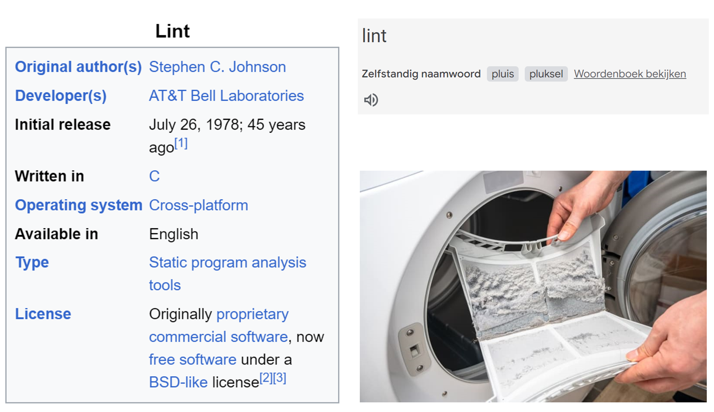

# Linters, validators, checkers
<!-- _class: title -->

Joost Farla - <j.farla@geonovum.nl>

Dimitri van Hees - <d.vanhees@geonovum.nl>

## Wat is een linter?


<!-- Lint is Engels voor pluisje -->

## Spellingscontrole voor code


## Voordelen

- Leesbare en onderhoudbare code
- Objectieve beoordeling van code
- Minder discussie over stijlkeuzes
- Betere beveiliging en performance
- Educatie over kwaliteit van code

## "ChatGPT, wat is het verschil met een validator?"

- Een validator controleert of een stuk code of document voldoet aan een bepaalde standaard of specificatie. Het bekijkt doorgaans de syntaxis, structuur en semantiek van de code of het document om te verzekeren dat het voldoet aan vooraf gedefinieerde criteria.
- Een linter is een tool die broncode analyseert om mogelijke fouten, bugs, stilistische inconsistenties of verdachte constructies op te sporen. In tegenstelling tot validators, richten linters zich vaak meer op de kwaliteit van de code, leesbaarheid en onderhoudbaarheid dan op strikte naleving van een standaard.

Kort samengevat, hoewel zowel validators als linters worden gebruikt om de kwaliteit van de code te verbeteren, zorgen validators voor naleving van standaarden, terwijl linters zich richten op codekwaliteit, stijl en potentiële problemen binnen de codebase.

## Linter of validator?

- Linter ≈ validator
- Formatters
- Code completion
- Etc.

## Checker
<!-- _class: title -->

## Generieke engine

- OGC Checker
- OAS Checker
- OAS "generator syntax" Checker
- Publiccode Checker

## Spectral
<!-- _class: image -->


<!-- 
- checkers obv spectral
- wat is spectral
-->

## Spectral ruleset syntax

```yaml
contact-properties:
  severity: error  # of "warn", "info", "hint"
  given: $.info.contact
  then:
    - field: name
      function: truthy
    - field: url
      function: truthy
    - field: email
      function: truthy
  message: Contact object must have "name", "url", and "email".
  documentationUrl: https://developer.overhe...
```

## API Design Rules (ADR) Ruleset

- In beheer bij Logius
- 2.0 kopie op <https://static.developer.overheid.nl/adr/ruleset.yaml>
- 2.1 kopie op <https://static.developer.overheid.nl/adr/2.1/ruleset.yaml>

## CLI

```bash
npm install -g @stoplight/spectral-cli
spectral lint -r https://static.developer.overheid.nl/adr/ruleset.yaml $OAS_URL_OR_FILE
```

## VSCode

```bash
# Install the extension from the vscode marketplace
$ code --install-extension stoplight.spectral

# Download the ruleset to your project home
$ curl -L https://static.developer.overheid.nl/adr/ruleset.yaml > .spectral.yml

# Run the IDE
$ code
```

## CI/CD pipeline

GitLab:

```yaml
spectral-lint:
  image: node:20
  stage: spectral_lint
  script:
    - npm install -g @stoplight/spectral-cli
    - curl -L https://static.developer.overheid.nl/adr/ruleset.yaml > .spectral.yml
    - spectral lint -r .spectral.yml $OAS_URL_OR_FILE
  rules:
    - if: '$CI_PIPELINE_SOURCE == "merge_request_event"'
      when: always
    - when: manual
```

## Waarom een eigen checker?
<!-- _class: title -->

## Additionele Spectral functions @TODO: Custom functions?

- Remote (JSON-)schema

  - Of een functie die dynamisch een schema teruggeeft

- Schema compatibility check

  - Dekt een schema minimaal een bepaald basis-schema af?
  - Rekening houdend met de flexibiliteit van JSON schema (o.a. combined schemas)

- Request parameter validatie

## Spectral test alleen spec

- Wat als we requests moeten doen?

## OGC API
<!-- _class: title -->

## Ruleset discovery

- OGC API standaard bestaat uit (sub-)modules
- Modules zijn geversioneerd
- 1 Spectral ruleset per module(-versie)
- Hoe weet je welke modules zijn geïmplementeerd?

## Landing page

```json
{
  "title": "3D Basisvoorziening",
  "links": [
    {
      "rel": "service-desc",
      "type": "application/vnd.oai.openapi+json;version=3.0",
      "title": "The JSON OpenAPI 3.0 document that describes the API offered at this endpoint",
      "href": "https://api.pdok.nl/kadaster/3d-basisvoorziening/ogc/v1/api"
    },
    {
      "rel": "conformance",
      "type": "application/json",
      "title": "OGC API conformance classes implemented by the API offered at this endpoint",
      "href": "https://api.pdok.nl/kadaster/3d-basisvoorziening/ogc/v1/conformance"
    }
  ]
}
```

@TODO: ADR?
Bron (PDOK): https://api.pdok.nl/kadaster/3d-basisvoorziening/ogc/v1/

## Conformance

```json
{
  "conformsTo": [
    "http://www.opengis.net/spec/ogcapi-common-1/1.0/conf/core",
    "http://www.opengis.net/spec/ogcapi-common-1/1.0/conf/json",
    "http://www.opengis.net/spec/ogcapi-common-1/1.0/conf/html",
    "http://www.opengis.net/spec/ogcapi-common-1/1.0/conf/oas30",
    "http://www.opengis.net/spec/ogcapi-common-2/1.0/conf/collections",
    "http://www.opengis.net/spec/ogcapi-features-1/1.0/conf/core",
    "http://www.opengis.net/spec/ogcapi-features-1/1.0/conf/html",
    "http://www.opengis.net/spec/ogcapi-features-1/1.0/conf/geojson",
    "http://www.opengis.net/spec/ogcapi-features-2/1.0/conf/crs",
    "http://www.opengis.net/spec/ogcapi-features-5/1.0/conf/schemas",
    "http://www.opengis.net/spec/ogcapi-features-5/1.0/conf/core-roles-features",
    "http://www.opengis.net/spec/ogcapi-features-5/1.0/conf/returnables-and-receivables",
    "http://www.opengis.net/spec/json-fg-1/0.2",
    "http://www.opengis.net/spec/ogcapi-geovolumes-1/1.0/conf/core"
  ]
}
```

Bron (PDOK): https://api.pdok.nl/kadaster/3d-basisvoorziening/ogc/v1/conformance

## Uitdagingen

- Profile-based content negotiation (https://www.w3.org/TR/dx-prof-conneg/)
  - In de OAS-spec is niet bekend welk schema correspondeert met welk profile
  - Het profile wordt uitgewisseld via links in de response body + `Link` header

```json
{
  "content": {
    "application/geo+json": {
      "schema": {
        "oneOf": [
          { "$ref": "#/components/schemas/featureGeoJSON" },
          { "$ref": "#/components/schemas/recordGeoJSON" }
        ]
      }
    }
  }
}
```

## Demo
<!-- _class: title -->

## Roadmap

- Lostrekken in aparte NPM package
- APIficeren
- Andere editor
- LSP
- Formatter!

## Vragen?
<!-- _class: title -->
