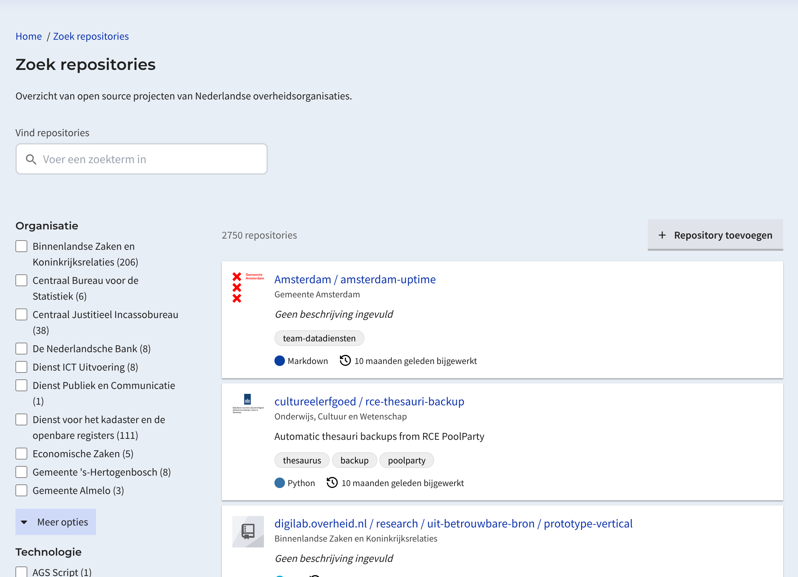
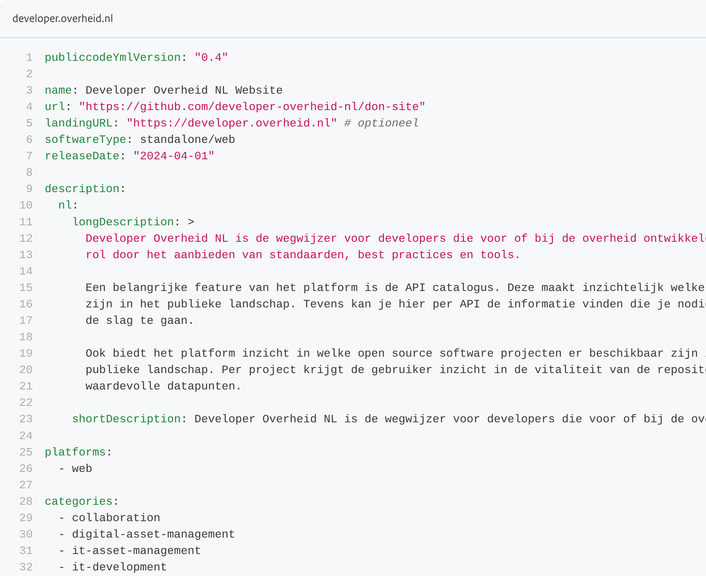

# Why further development on `publiccode.yml` is necessary to improve European cooperation

<!-- _class: title -->

<ul class="horizontal-list" style="margin-top: 3rem;">
  <li>Tom Ootes</li>
  <li>🐘 <a href="https://hostux.social/@tomootes">@tomootes</a></li>
  <li>Open Source Summit Europe</li>
  <li>27 August 2025</li>
</ul>

<!--

- So I know you guys have been in this situation:
- your product owner or manager comes up to you and your team
- They ask you to build a new solution to a problem your organization has been having for a while
- These kind of situations always make me think
- There probably is an other government organization out there with the same problem
- Putting a lot of effort and money in building this
- How cool if we could find this
- We could consider co-operating and investing together to ultimately improve government services
- We can save a lot money, and build better stuff!
- This presentation is about the publiccode.yml
- Which is a metadata standard for Open Source projects within public administrations
- It aims to make Open Source projects explorable

-->

## **whoami**

  

      <b>Tom Ootes</b>
      
🙋🏻 Developer Advocate

      
🧰 developer.overheid.nl

      
🎸 Making music

      
🌳 Love biology

  

  

    
  

<!--
- Im am Tom Ootes
- I work as a freelancer in IT, as a developer
- Ive done a lot of projects for the Dutch Government as a freelancer
- During my work
- As a developer advocate
- Besides this i have a band with which i like to play together
- I also really enjoy reading about biology, and i am a big fan of Alexander von Humboldt, the naturalist and explorer.
-->

##
<!-- _class: title -->
<ul>
  <li>How i ended up at developer.overheid.nl</li>
  <li>How i discovered publiccode.yml</li>
  <li>What it is</li>
  <li>Some perspective for action</li>
</ul>

## **How did i get here?**

- 😷 Worked on the Dutch contact tracing software [COVID-19]
- 📋 Big project to inform citizens / obtain statistics
- ⚕️ Dutch Ministry of Health

### Am I missing something?

- 👌🏻 Cool project
- 📖 Missing docs!

## Very little documentation!

  
🤔

<!--
- I have been working as a freelance developer for almost 10 years now
- Doing mostly projects for Dutch government organizations
- During the Covid Crisis i was hired to work on the software for Contact-tracing covid cases within The Netherlands.
- The platform helped employee of the health services survey citizens who were infected with covid
- The goal of the product was to inform citizens on their infection and give them behavioural instructions
- Another goal was to obtain data on local outbreaks to base policy decisions on.
-->

<!-- _class: title -->

<!-- ## **Dev questions:**

- Code style (linters)?
- Assess OS libraries?
- Interpret policies?
- Co-operate?
- What OS resources are available?
- Which tools?
- Become compliant with government standards? -->
 
## What if I had answers?
<!-- _class: title -->

  
💭

- Higher code quality
- Better accessibility
- Less tech debt
- Better compliancy of standards

## 👏🏻 Better services!

<!-- _class: title -->

<h1 class="pt-0">For <i>all</i> citizens</h1>

## Tadaaaaaaaaaaa: developer.overheid.nl

<!-- _class: title -->

  
🌈

<!--
- We are a team that is building a developer portal for the whole Dutch government
- We do so by working on a couple of products
- OSS Catalogue > has been around for five years now.
  - This presentation is about how we want to refactor this catalogue, based on publiccode.yml
- API Catalogue > gov orgs can add their API here
- Knowledgebase with articles on for example how to become Double-U-Cee-A-Gee compliant
-- We also have tutorials en tools, for example on how to install and use the Dutch gov Design System.
-->

## Knowledge base

## Implementation Support

<!-- _class: title -->

  
☎️

## Blog

## API Catalogue

## Open Source Catalogue

## Future plans 🧑🏻‍🔧

- Generate API client/ libraries
- Generate mock API's based on specs
- Data model catalogue
- 1000 other idea's / backlog is endless 📜

## How can we provide better government services?

<h1 class="pt-0">Psst: re-use 💡</h1>

<ul>
  <li>Co-operate!</li>
  <li>Stop re-inventing wheels!</li>
  <li>Consolidate knowledge!</li>
</ul>

<!-- _class: title -->

## But what's available?

<!--
- How do i explore these projects?
- Where can i find them?
-->

<!-- _class: title -->

## Catalogues

- Available: 🇫🇷 / 🇮🇹 / 🇩🇪 / 🇳🇱

  
  
🇪🇺

<!-- 
- Thats where software catalogues come in 
- And the coolest thing is that i found out they are all based on the publiccode.yml standard

-->

## 🪄 publiccode.yml
<!-- _class: title -->

  

    <ul>
      <li>Created in 2018, in Italy</li>
    </ul>
  

  

    
  

<ul>

</ul>

## But! It is not good enough

<!-- _class: title -->

## Not future proof

  

      
- REST API based landscape
- Cross-organizational data exchange
- Based on services and smaller components
  

  

    
  

<!-- _class: title -->

## Would you kindly? 👇🏻

- Do you want to make your OS project explorable? Add a publiccode.yml!
- Encourage your organization to start using it
- Give us feedback based on your experience
- File [issues](https://github.com/publiccodeyml/publiccode.yml/issues) for ideas
- Start [discussions](https://github.com/publiccodeyml/publiccode.yml/discussions), engage, reach out

<h1 class="pt-0">Together we can improve government services (drastically)!</h1>

<!-- _class: title -->

## Big thanks! 🙌
<!-- _class: title -->
<h1 class="pt-0">Questions?</h1>

### Let's stay in touch

📩 tom@ootes.io

🐘 hostux.social/@tomootes

<!-- _class: title -->
<!-- Hopefully see you again, on the internet? -->

