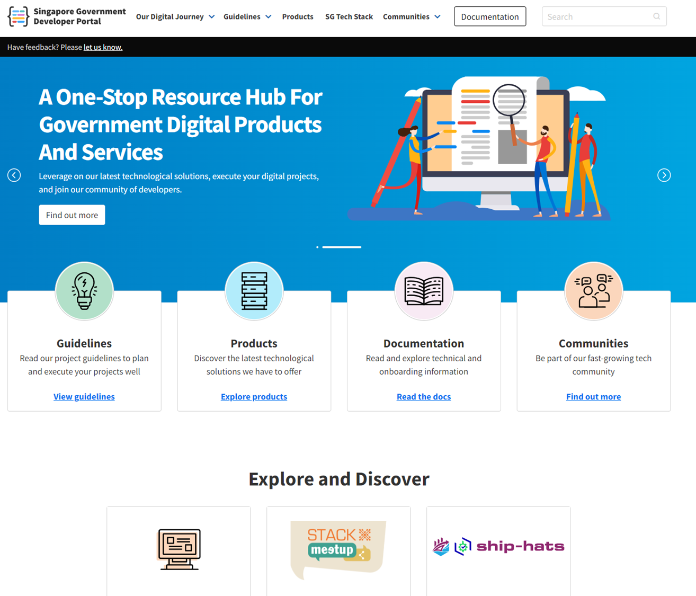
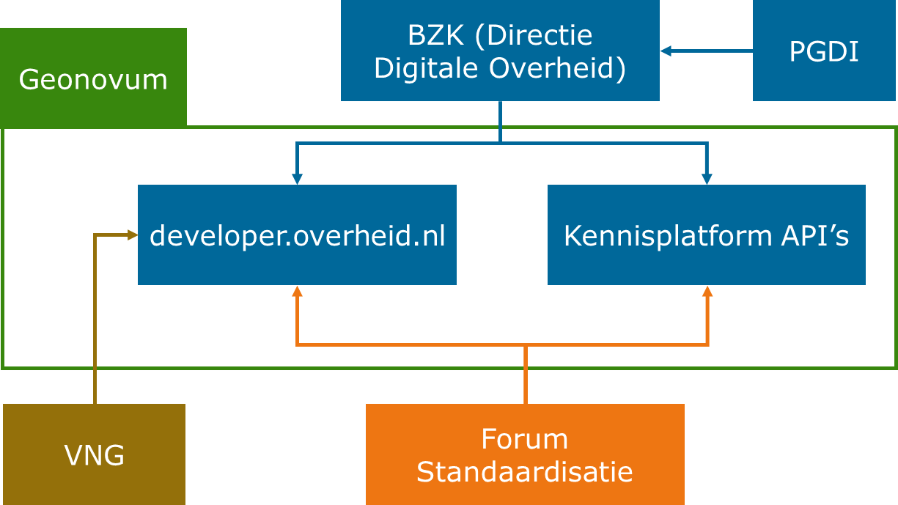
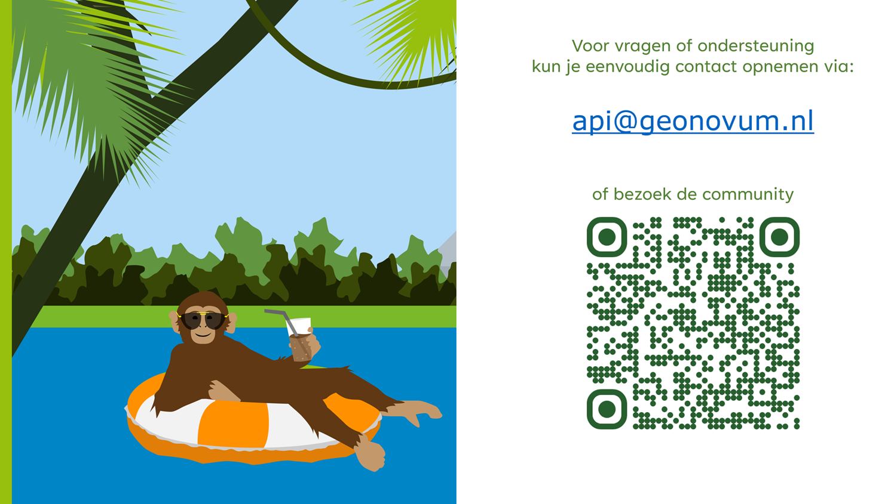
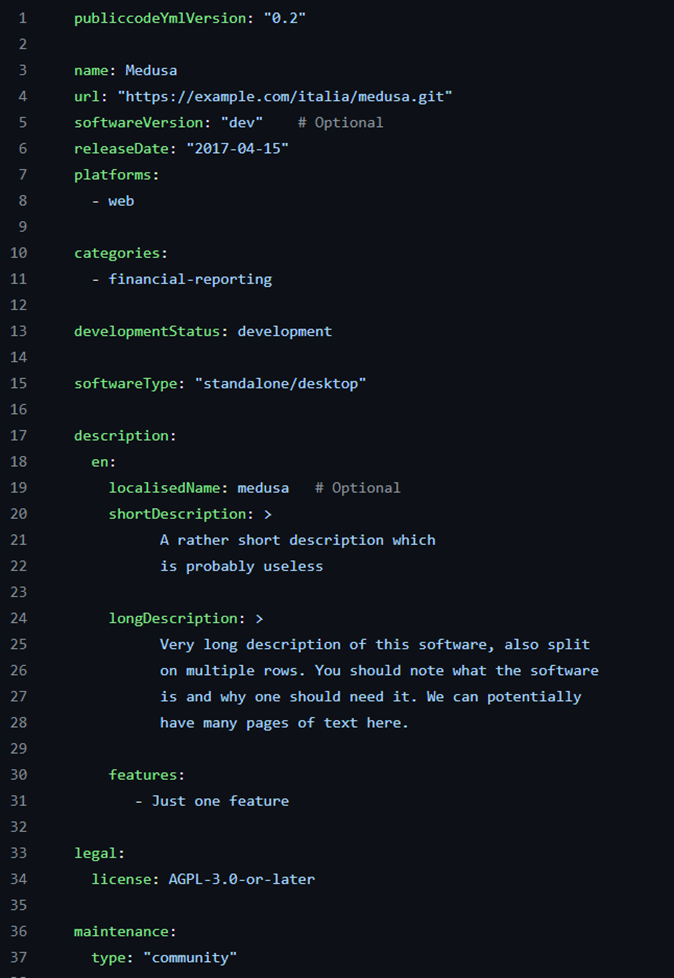

# developer.overheid.nl
<!-- _class: title -->

Dimitri van Hees
<d.vanhees@geonovum.nl>

<!-- This is presenter note. You can write down notes through HTML comment. -->

## Developer portal

- "A developer portal provides a central place for developers to discover and use services."
- "To be clear, **it's not simply an API catalog**. It comprises more than a list of API specs and documentation."
- "It's a **central place for developers to go and learn** about the systems that they work on and interact with."
- "It provides **self-service tools** to get devs integrated quickly and easily."
- "And it gives folks **a place to go when they have questions**."

https://www.opslevel.com/resources/developer-portals-what-are-they-and-why-do-you-need-them

## developer.italia.it
<!-- _class:image -->


## developer.tech.gov.sg
<!-- _class:image -->



## developer.overheid.nl
<!-- _class: image -->


## Organisatie



## Kernteam

- Product Owner: Dimitri van Hees
- Developer Advocate: Tom Ootes
- Front-end: Jaap-Hein Wester
- Backend: Matthijs Hovestad
- Projectleider: Vivian van der Heijden

## Implementatieondersteuning

- Joost Farla
- Martin van der Plas
- Frank Terpstra

## Release early, release often
<!-- _class: title -->

## Practice what you preach

- Front-end op basis van NL Design System
- Open Source
- API first

## Implementatieondersteuning API's



## Nieuwe ADR validator

- Compatible met nieuwe versie API Design Rules
- Valideert tegen OAS
- Accepteert afwijkende OAS locatie
- Betere resultaten in API dashboard

## Integratie communities

- Kennisplatform API’s
- Digilab
- OSPO-NL

## API register
<!-- _class: title -->

## Focus op REST

- WMS/WFS -> OGC API = REST
- ODATA (4) = "REST"
- GraphQL (1)
- CKAN (1)
- Atom (1)
- Socrata (1)

## OpenAPI-first

- Contact info (ADR 2.1)
- Environments (nog niet in ADR)
- Security (mTLS vanaf 3.1)
- Example(s) tbv mocking services en SDK’s
- JSON schemas (vanaf 3.1)

## Organisatie - oude situatie

- Hard gekoppeld aan Register van Overheidsorganisaties (ROO)
- Gouden API winnaar "SURF" staat niet in ROO; API kan niet naar register
- Iedereen kan API's toevoegen namens een organisatie via GitLab

## Organisatie - nieuwe situatie

- Identificatie o.b.v. credentials
- Gekoppeld aan TOOI (waar mogelijk)
- Uitzondering voor organisaties buiten ROO

## TOOI API

- Gemeente Utrecht: <https://identifier.overheid.nl/tooi/id/gemeente/gm0344>
- API resource: <https://api.standaarden.overheid.nl/v1/overheidsorganisaties/https%3A%2F%2Fidentifier.overheid.nl%2Ftooi%2Fid%2Fgemeente%2Fgm0344>
- Adressen: <https://api.standaarden.overheid.nl/v1/overheidsorganisaties/https%3A%2F%2Fidentifier.overheid.nl%2Ftooi%2Fid%2Fgemeente%2Fgm0344/adressen>
- Caching versus "Data bij de Bron"...

## Nieuwe aanleverprocedure


## API verwijderen

- Contact opnemen om API te laten verwijderen
- Dit omdat een API niet zomaar "verwijderd" kan worden; dit is een lifecycle wijziging

## API Lifecycle
<!-- _class: title -->

## API Lifecycle "End-of-Life" phase


## Geen standaard, wél API register extensie

```yaml
openapi: 3.0.3
info:
  version: 1.2.3
  x-deprecated: 2025-10-10 # toekomst of verleden
  x-sunset: 2027-11-11     # altijd in de toekomst
```

<https://github.com/Geonovum/KP-APIs/issues/649>

## Abonneren op API

- Op de hoogte blijven van (lifecycle) wijzigingen
- Via RSS of Discourse
- Of "Ik gebruik deze API" via e-mail
- Ook voor providers fijn

## OAS 3.1 support

- Automatisch omzetten van OAS 3.0.x naar 3.1.0
- JSON Schema's extraheren
- Typescript types, Java classes etc. genereren

## Open Source register
<!-- _class: title -->

## Open Source

- "Open, tenzij..."
- EU verplichting
- Samenwerking Frankrijk, Italië en Brussel
- Don't reinvent the wheel!
- Publiccode.yaml first

## Publiccode.yaml

- "OpenAPI voor Open Source projecten"
- Europese standaard van Nederlandse bodem
- Aansluiting bij OSS directory van de Europese Commissie
- Aanmelding pas-toe-leg-uit
- <https://joinup.ec.europa.eu/publiccode-editor/>

## Publiccode.yaml

<!-- _class: image -->



## Schema register
<!-- _class: title -->

## DVLA-1
<!-- _class: image -->


## DVLA-2
<!-- _class: image -->


## schemas.developer.overheid.nl

- CORS policy
- Versiebeheer
- Zoeken
- API design; hergebruik en goede examples in docs

## openapi.yaml

```yaml
/apis/{id}:
  parameters:
    - $ref: "#/components/parameters/id"
  get:
    responses:
      "200":
        content:
          application/json:
            schema:
              $ref: "https://schemas.developer.overheid.nl/api.json"
```

## https:\/\/schemas.developer.overheid.nl/api.json

```json
{
  "$schema": "http://json-schema.org/draft-04/schema#",
  "type": "object",
  "properties": {
      "titel": {
          "type": "string"
      },
      "organisatie": {
        "type": "object",
        "properties": {
          "$ref": "https://schemas.standaarden.overheid.nl/tooi/organisatie.json"
        }
      }
  },
  "required": [
    "titel",
    "organisatie"
  ]
}
```

## https:\/\/schemas.standaarden.overheid.nl/tooi/organisatie.json

```json
{
  "$schema": "https://json-schema.org/draft/2020-12/schema",
  "type": "object",
  "properties": {
    "officieleNaam": {
      "type": "string"
    },
    "verkorteNaam": {
      "type": "string"
    },
    "uri": {
      "type": "string"
    },
    "adres": {
      "type": "object",
      "$ref": "https://schemas.developer.overheid.nl/adres.json" // enz.
    }
  }
}
```

## Techradar
<!-- _class: title -->

## Help mee

- Kennisbank artikelen
- Blogposts
- Interviews
- Pull requests
- Feature requests
- Ideeën
- Spread the word!

## Op naar één centrale plek voor software development bij de overheid!
<!-- _class: title -->

- Bijdragen: <https://developer.overheid.nl/contributing>
- Mastodon: <https://social.overheid.nl/@developer>
- Slack: <https://codefornl.slack.com/archives/CFV4B3XE2>
- Github: <https://github.com/developer-overheid-nl>
- E-mail: <developer.overheid@geonovum.nl>
