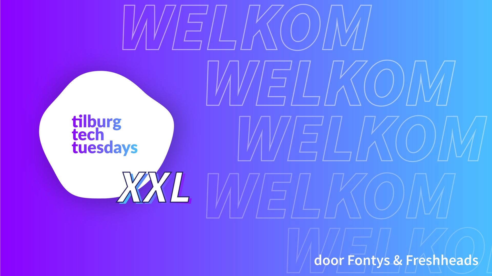
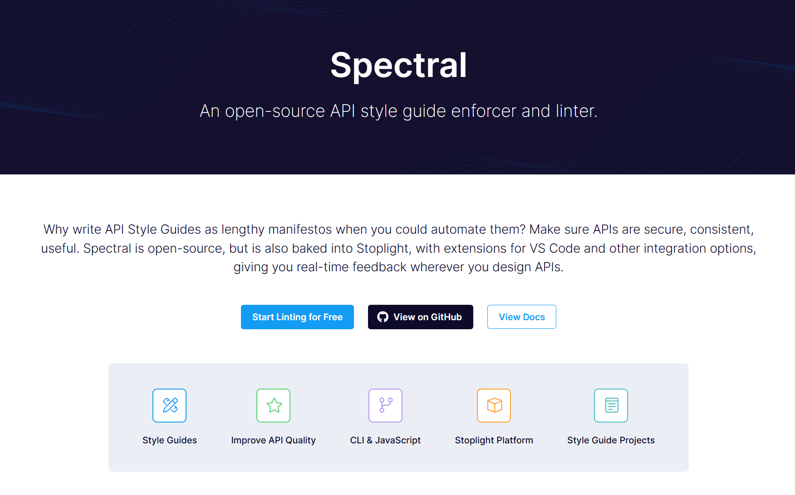
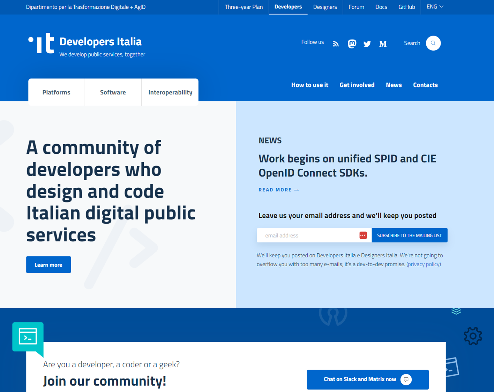

## start
<!-- _class: image -->


## Design Rules to Developer Happiness
<!-- _class: title -->

Dimitri van Hees
<d.vanhees@geonovum.nl>

## About me

- Dimitri van Hees
- API architect, consumer, provider and evangelist
- Former Head of Architecture @ Freshheads (2005 - 2015)
- Co-author of NLGov API Strategy and NLGov API Design Rules
- OpenAPI Specification contributor
- Product Owner @ developer.overheid.nl
- Co-owner and craft brewer @ Brouwtoren Nijmegen

## The OpenAPI Specification
<!-- _class: title -->

## APIs

- REST +
- RESTful +
- RESTish =
- HTTP APIs

## API Specification

Describes the 'contract' between an API and a client. It specifies which operations can be performed, security protocols, supported data formats, etc. Comparable to WSDL for SOAP.

## API Reference

Human-readable variant of the API Spec. In addition to tutorials and other non-technical information, part of the API Docs which can be found on an API/Developer Portal.

## API Specification frameworks

- Swagger (Smartbear)
- RAML (Mulesoft)
- API Blueprint (IBM)

## Swagger

```yaml
swagger: "2.0"
info:
  title: Beer API
  description: Beer API for demo purposes.
  version: 1.0.0
schemes:
  - https
consumes:
  - application/json
produces:
  - application/json
parameters:
  id:
    name: id
    in: path
    description:  Unique ID to identify a beer.
    required: true
    type: string
paths:
  /beers/{id}:
    get:
      summary: Retrieve a single beer
      description: With this call the client can retrieve a single beer.
      parameters:
        - $ref: "#/parameters/id"
      responses:
        200:
          description: Representation of the single beer.
          schema:
            $ref: "#/definitions/Beer"
```

## RAML

```yaml
#%RAML 1.0
---
title: Beer API
description: Beer API for demo purposes.
version: 1.0.0
/beers:
  /{id}:
    get:
      description: With this call the client can retrieve a single beer.
      responses:
        200:
          body:
            application/json:
              example: |
```

## API Blueprint

```markdown
FORMAT: 1A

# Beer API
Beer API for demo purposes.

## API Blueprint

# GET /beers
+ Response 200 (application/json)
```

## Machine-readable
<!-- _class: title -->

## Codegen

- References
- Tests
- Developer SDKs
- Validators
- Server code
- Gateway configurations
- Etc.

## Popularity

|Framework|Community|
|-|-|
|Swagger|🙌🙌🙌🙌🙌🙌🙌🙌🙌🙌🙌🙌🙌🙌🙌🙌🙌🙌🙌🙌🙌🙌🙌🙌|
|RAML|🙌🙌🙌🙌🙌🙌🙌🙌🙌|
|API Blueprint|🙌🙌🙌|

## Tadaaaaaaaaaaa


## OpenAPI Specification (OAS) 3

- Based on Swagger 2.0 ("fka Swagger")
- Stable since 2017
- Open Source
- Vendor neutral

## "OpenAPI becomes the de facto standard in this industry" - Microsoft, 2017
<!-- _class: title -->

## Netherlands Standardisation Forum

> The Netherlands Standardisation Forum facilitates digital cooperation (interoperability) between government organizations and between government, businesses and citizens. Interoperability ensures that different systems are better aligned and integrated. Therefore, data can be exchanged and/or reused more easily.

<!-- Mandatory and recommended standards -->

## PTLO
<!-- _class: image -->


## NLGov API Strategy
<!-- _class: title -->

## Mandatory standards ("apply or explain")

- If you publish an API, it **must** be accompanied by an OpenAPI Specification
- If you publish an API, it **must** comply with the NLGov API Design Rules (ADR)
- Video: <https://www.forumstandaardisatie.nl/open-standaarden/openapi-specification>

## API Design Rules

- Better if everyone does it wrong than everyone does it different
- Reusability
- Codegen
- Stop reinventing the wheel

## NLGov API Design Rules

- `/core/no-trailing-slash`: Leave off trailing slashes from URIs
- `/core/path-segments-kebab-case`: Use kebab-case in path segments
- `/core/query-keys-camel-case`: Use camelCase in query keys
- `/core/http-methods`: Only apply standard HTTP methods
- `/core/doc-openapi-contact`: Document contact information
- `/core/uri-version`: Include the major version number in the URI
- `/core/version-header`: Return the full version number in a response header

## Spectral
<!-- _class: image -->


## ruleset.yaml

```yaml
rules:
  nlgov:missing-header:
    severity: error
    given: $..[responses][?(@property && @property.match(/(2|3)\d\d/))]
    then:
      field: headers
      function: truthy
    message: "Return the full version number in a response header."
    documentationUrl: "https://developer.overheid.nl/kennisbank/apis/api-design-rules/hoe-te-voldoen/version-header"

  nlgov:include-major-version-in-uri:
    severity: error
    given:
      - "$.servers[*]"
    then:
      function: pattern
      functionOptions:
        match: "\\/v[\\d+]"
      field: url
    message: "Include the major version number in the URI."
    documentationUrl: "https://developer.overheid.nl/kennisbank/apis/api-design-rules/hoe-te-voldoen/uri-version"

  nlgov:paths-no-trailing-slash:
    severity: error
    given:
      - "$.paths"
    then:
      function: pattern
      functionOptions:
        notMatch: ".+ \\/$"
      field: "@key"
    message: "Leave off trailing slashes from URIs."
    documentationUrl: "https://developer.overheid.nl/kennisbank/apis/api-design-rules/hoe-te-voldoen/no-trailing
```

## Lint

### CLI

```bash
npm install -g @stoplight/spectral-cli
spectral lint -r https://static.developer.overheid.nl/adr/ruleset.yaml $OAS_URL_OR_FILE
```

### IDE

```bash
code --install-extension stoplight.spectral
curl -L https://static.developer.overheid.nl/adr/ruleset.yaml > .spectral.yml
code
```

### Docker

```bash
docker run --rm --entrypoint=sh \
    -v $(pwd)/api:/locale stoplight/spectral:5.9.1 \
    -c "spectral lint -r https://static.developer.overheid.nl/adr/ruleset.yaml"
```

## developer.overheid.nl
<!-- _class: title -->

## Background

- European Commission API meeting 2018
- Autonomous municipalities, provinces, waterboards, etc.
- Not one responsible government organisation in The Netherlands
- Poor cooperation; everyone kept reinventing the wheel
- Until...

## The best enabler
<!-- _class: image -->


## Developer portal

- "A developer portal provides a central place for developers to discover and use services."
- "To be clear, **it's not simply an API catalog**. It comprises more than a list of API specs and documentation."
- "It's a **central place for developers to go and learn** about the systems that they work on and interact with."
- "It provides **self-service tools** to get devs integrated quickly and easily."
- "And it gives folks **a place to go when they have questions**."

<https://www.opslevel.com/resources/developer-portals-what-are-they-and-why-do-you-need-them>

## developer.italia.it
<!-- _class: image -->



## developer.tech.gov.sg
<!-- _class: image -->


## don homepage
<!-- _class: image -->


## Release early, release often
<!-- _class: title -->

## Practice what you preach

- Front-end based on NL Design System
- Open Source
- API first

## Features

- Knowledge base
- Communities
- Blog
- Open Source register
- API register
- Tools

## API Tools

- OAS generator
- OAS checker
- OAS converter (3.0 to 3.1 and back)
- Design rules code templates

## Design-first API development

1. Create OAS
    - Codegen OAS *boilerplate*
    - Improve boilerplate to 0.0.1 version
    - Check OAS compliancy with Design Rules
    - Collect and process feedback
1. Mock API
    - Codegen stubs/use mocking services
    - Start client development (Rapid Development)
1. Codegen server code
1. Apply business logic

## Tools: from standard to code

1. OAS generator (codegen *boilerplate* OAS)
2. OAS checker (checks ADR compliancy)
3. Code generator (generates working code from OAS)
4. Design rules code templates (used in generated code to comply)

## Demo
<!-- _class: title -->

## API register
<!-- _class: title -->

## OAS first

- Contact info
- Environments
- Security
- Examples

<!-- Missing link in OAS: API lifecycle info -->

## API Lifecycle


## API register extensions

```yaml
openapi: 3.0.3
info:
  version: 1.2.3
  x-deprecated: 2025-10-10 # future or past
  x-sunset: 2027-11-11     # future
```

## API Codegen

- Client libraries
- Server libraries
- Mocking services
- JSON schemas
- Version control

## JSON Schemas
<!-- _class: title -->

## https:\/\/api.developer.overheid.nl/api-register/v1/openapi.json

```json
{
  "/beers/{id}": {
    "parameters": [
      {
        "$ref": "#/components/parameters/id"
      }
    ],
    "get": {
      "responses": {
        "200": {
          "content": {
            "application/json": {
              "schema": {
                "$ref": "https://schemas.developer.overheid.nl/beer.json"
              }
            }
          }
        }
      }
    }
  }
}
```

## https:\/\/schemas.developer.overheid.nl/beer.json

```json
{
  "$schema": "http://json-schema.org/draft-04/schema#",
  "type": "object",
  "properties": {
      "name": {
          "type": "string"
      },
      "brewery": {
        "type": "object",
        "properties": {
          "$ref": "https://schemas.developer.overheid.nl/brewery.json"
        }
      }
  },
  "required": ["name", "brewery"]
}
```

## https:\/\/schemas.developer.overheid.nl/brewery.json

```json
{
  "$schema": "https://json-schema.org/draft/2020-12/schema",
  "type": "object",
  "properties": {
    "name": {
      "type": "string"
    },
    "url": {
      "type": "string"
    },
    "address": {
      "type": "object",
      "$ref": "https://schemas.developer.overheid.nl/address.json"
    }
  },
  "required": ["name"]
}
```

## DVLA
<!-- _class: image -->


## Typescript

```ts
export interface Beer {
  name: string;
  brewery: Brewery;
  alcohol?: number;
}
```

```ts
export interface Brewery {
  name: string;
  address: Address;
  url?: string;
}
```

```ts
export interface Address {
  street: string;
  postalCode: string;
  //etc....
}
```

## Schema register

- Discoverability
- Reusability
- Versioning
- Documentation
- Codegen of types, classes, etc.

## Large Language Models!
<!-- _class: title -->

## Next up: Arazzo

```yaml
arazzo: 1.0.1
info:
  title: Title
  summary: Summary
  version: 0.0.1
sourceDescriptions:
  - name: beerAPI
    url: http://localhost:8080/beer-api/v1/openapi.json
    type: openapi
workflows:
  - workflowId: buyBeer
    steps:
      - stepId: getBeer
        operationId: $sourceDescriptions.beerAPI.getBeer
      - stepId: addToCart
        operationId: $sourceDescriptions.beerAPI.addToCart
```

<!-- Next level SDK's together with AI and vibe coding -->

## Key takeaways

- Use OpenAPI Specification to describe APIs
- Use a *design-first* approach to enable *rapid development*
- Introduce API Design Rules to simplify API design and generate code templates
- Enforce API Design Rules with *Spectral rulesets*
- (re)Use JSON Schemas in your OpenAPI Specifications to simplify API Design
- (re)Use JSON Schemas to codegen types and classes

## One more thing...

Don't forget to check https://nerdvote.nl next week!

## Questions?
<!-- _class: title -->

- Contribute: <https://developer.overheid.nl/contributing>
- Mastodon: <https://social.overheid.nl/@developer>
- Slack: <https://codefornl.slack.com/archives/CFV4B3XE2>
- Github: <https://github.com/developer-overheid-nl>
- E-mail: <developer.overheid@geonovum.nl>
